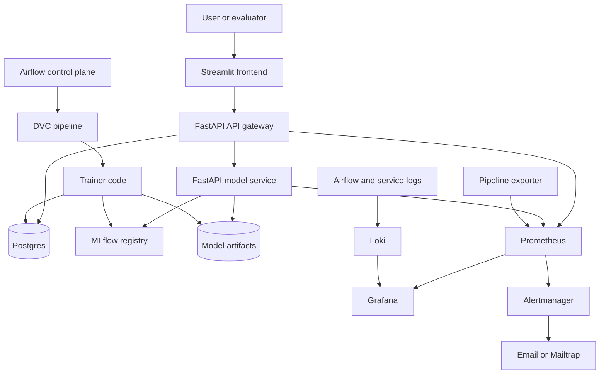
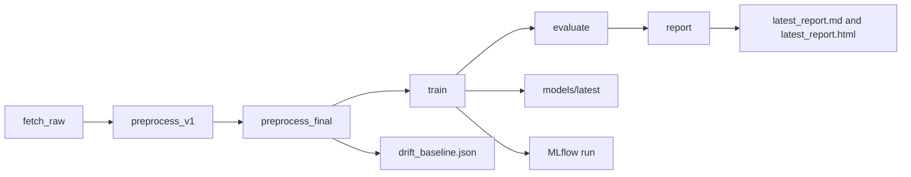
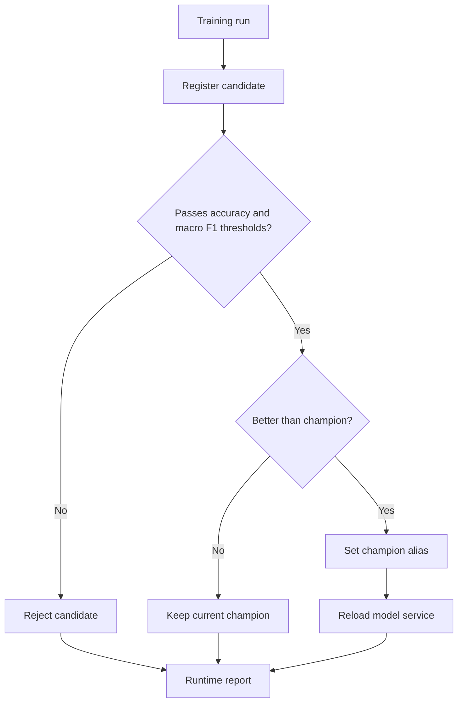
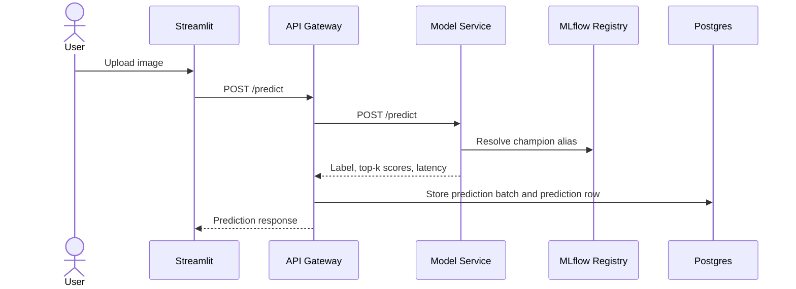

# Galaxy Morphology Classification with MLOps

**Final Project Report**  
Generated on: 28 April 2026  
Project type: End-to-end machine learning application with MLOps lifecycle

## Abstract

This project implements a complete MLOps platform for classifying galaxy morphology from images. The application predicts one of five classes: `elliptical`, `spiral`, `lenticular`, `irregular`, and `merger`. It includes a user-facing Streamlit interface, FastAPI gateway, dedicated model-serving service, reproducible DVC pipeline, Airflow orchestration, MLflow experiment tracking and model registry, Postgres-backed application state, Prometheus metrics, Grafana dashboards, Loki log aggregation, and Alertmanager email alerts.

The system supports both model development and live operation. Users can upload a single galaxy image or ZIP batch, view predictions and confidence scores, submit corrections, and inspect recent predictions. The engineering workflow supports data ingestion, preprocessing, training, evaluation, candidate model registration, champion promotion decisions, runtime reporting, monitoring, and feedback-aware retraining.

## Table of Contents

1. Project Overview
2. Requirements Coverage
3. System Architecture
4. Data and ML Pipeline
5. Model Training and Registry
6. Application Design
7. Feedback and Continuous Improvement
8. Observability and Alerting
9. Deployment
10. Testing and Validation
11. Runtime Results
12. Proof Screenshots
13. Conclusion
14. References

## 1. Project Overview

### 1.1 Problem Statement

Galaxy morphology classification is the task of identifying a galaxy's visual structure from an astronomical image. Manual classification is time-consuming and does not scale well. This project automates the task by training and serving a deep learning image classifier while also demonstrating the operational practices required for a maintainable ML system.

### 1.2 Goals

The project goals are:

- Build a working galaxy image classifier.
- Provide a simple user interface for single-image and batch predictions.
- Store predictions and user feedback for later analysis.
- Maintain a reproducible training and evaluation pipeline.
- Track experiments, metrics, parameters, and model artifacts.
- Use a model registry with a champion deployment alias.
- Automate retraining decisions through an orchestration layer.
- Monitor service health, latency, prediction activity, and pipeline state.
- Capture proof screenshots for final evaluation.

### 1.3 Scope

The system is designed as a local Docker Compose deployment suitable for academic demonstration and reproducible evaluation. It uses a controlled Galaxy Zoo image subset and focuses on demonstrating the full ML lifecycle rather than maximizing production-scale model accuracy.


## 2. System Architecture

The architecture separates responsibilities into independently understandable layers:

- **User layer:** Streamlit frontend and pipeline console.
- **Serving layer:** FastAPI API gateway and FastAPI model service.
- **ML lifecycle:** DVC pipeline, trainer code, generated reports, and MLflow tracking.
- **Control plane:** Airflow DAG for runtime decisions and automated actions.
- **State and artifacts:** Postgres for application state and filesystem/DVC for datasets and model exports.
- **Observability:** Prometheus, Grafana, Loki, Promtail, and Alertmanager.



### 3.1 Key Design Decisions

| Design Decision | Reason |
|---|---|
| DVC for the training pipeline | Provides deterministic stages, dependencies, outputs, and reproducibility |
| Airflow for the control plane | Handles branching, scheduled checks, model registration, reloads, and report email |
| Separate API and model service | Keeps storage and UI concerns separate from model loading and inference |
| MLflow model registry | Supports candidate versions and a stable champion alias for serving |
| Postgres for state | Stores predictions, feedback corrections, service logs, and artifact snapshots |
| Prometheus and Grafana | Provide metric collection and operational dashboards |
| Loki and Promtail | Provide centralized log visibility |

## 4. Data and ML Pipeline

The DVC pipeline owns deterministic data and model artifact lineage. It downloads a Galaxy Zoo subset, prepares image data, trains the classifier, evaluates metrics, and generates reports.



| DVC Stage | Purpose | Main Outputs |
|---|---|---|
| `fetch_raw` | Download and summarize Galaxy Zoo source images | Raw image dataset and raw summary |
| `preprocess_v1` | Resize and normalize image structure | Processed v1 dataset and summary |
| `preprocess_final` | Create train, validation, and test splits | Final dataset split and drift baseline |
| `train` | Train the PyTorch classifier | Model export and training metrics |
| `evaluate` | Evaluate offline and live feedback metrics | Test and live metric snapshots |
| `report` | Generate final pipeline reports | Markdown and HTML reports |

### 4.1 Dataset Snapshot

The latest generated pipeline report records a balanced 500-image dataset:

| Class | Raw Images | Train | Validation | Test |
|---|---:|---:|---:|---:|
| elliptical | 100 | 70 | 15 | 15 |
| spiral | 100 | 70 | 15 | 15 |
| lenticular | 100 | 70 | 15 | 15 |
| irregular | 100 | 70 | 15 | 15 |
| merger | 100 | 70 | 15 | 15 |
| **Total** | **500** | **350** | **75** | **75** |

## 5. Model Training and Registry

The classifier is trained with a ResNet18-based PyTorch workflow. Training logs metrics, parameters, and artifacts to MLflow. The latest trained model is exported locally under `models/latest`, and candidate models can be registered to MLflow.

### 5.1 Registry Workflow



The serving model URI is:

```text
models:/galaxy_morphology_classifier@champion
```

This keeps the deployed model stable. A newly trained model must pass validation and comparison logic before it becomes the serving champion.

## 6. Application Design

The application has a frontend, API gateway, and model service.

### 6.1 User Workflows

| Workflow | User Action | System Response |
|---|---|---|
| Single prediction | Upload one image | Returns predicted label, top-k confidence scores, latency, and model version |
| Batch prediction | Upload ZIP file | Returns a batch ID and per-image prediction table |
| Single correction | Submit true label after a prediction | Stores correction feedback in Postgres |
| CSV correction | Export recent predictions, fill corrections, upload CSV | Validates rows and stores accepted corrections |
| Pipeline console | Open health links and service pages | Shows visibility into Airflow, MLflow, Prometheus, Grafana, Loki, and API docs |

### 6.2 Main API Endpoints

| Service | Endpoint | Purpose |
|---|---|---|
| API | `GET /health` | Liveness check |
| API | `GET /ready` | Readiness check for database and model service |
| API | `POST /predict` | Single image prediction |
| API | `POST /predict-batch` | ZIP batch prediction |
| API | `POST /feedback` | Single-record correction |
| API | `POST /feedback/upload-csv` | Validated correction CSV upload |
| API | `GET /recent-predictions` | Prediction history |
| API | `GET /recent-predictions/export` | Correction CSV template export |
| API | `GET /metrics` | Prometheus metrics |
| Model service | `POST /predict` | Model inference |
| Model service | `POST /reload` | Reload champion or fallback model |
| Model service | `GET /metrics` | Model-serving metrics |

### 6.3 Prediction Sequence



## 7. Feedback and Continuous Improvement

The project supports a closed feedback loop:

1. A user uploads an image or batch and receives predictions.
2. The API stores prediction records in Postgres.
3. The user submits single-record feedback or uploads a correction CSV.
4. Feedback corrections are stored in Postgres.
5. Airflow inspects feedback counts and runtime metrics.
6. If retraining is required, DVC regenerates data, model, metrics, and reports.
7. A candidate model is registered and validated.
8. The model is promoted only if it passes quality criteria.

```mermaid
flowchart LR
  Predict[Prediction] --> Store[Store in Postgres]
  Store --> Feedback[User correction]
  Feedback --> Snapshot[Feedback snapshot]
  Snapshot --> Airflow[Airflow decision]
  Airflow --> DVC[DVC retraining]
  DVC --> Candidate[Candidate model]
  Candidate --> Registry[MLflow registry decision]
  Registry --> Serving[Champion serving model]
```



## 8. Observability and Alerting

The system provides operational visibility through metrics, dashboards, logs, and alerts.

| Signal | Tool | Evidence |
|---|---|---|
| API and model readiness | FastAPI health and readiness endpoints | `/health` and `/ready` |
| Service metrics | Prometheus | `/metrics` endpoints |
| Pipeline metrics | Pipeline exporter | Prometheus scrape target |
| Dashboards | Grafana | Provisioned MLOps dashboard |
| Logs | Loki and Promtail | Grafana log explorer |
| Email alerts | Alertmanager and Mailtrap | Alert email screenshot |
| Database state | Adminer | SQL proof screenshot |

Alertmanager was configured for email delivery through Mailtrap. The proof screenshots show both alert configuration and received email evidence.

## 9. Deployment

The project is deployed locally with Docker Compose. The stack includes:

- `postgres`
- `redis`
- Airflow API server, scheduler, worker, triggerer, and DAG processor
- `trainer`
- `pipeline-exporter`
- `model-service`
- `api`
- `frontend`
- `mlflow`
- `prometheus`
- `alertmanager`
- `loki`
- `promtail`
- `grafana`
- `adminer`

### 9.1 Service URLs

| Tool | URL |
|---|---|
| Frontend | `http://localhost:8501` |
| API docs | `http://localhost:8002/docs` |
| Airflow | `http://localhost:8080` |
| MLflow | `http://localhost:5000` |
| Prometheus | `http://localhost:9090` |
| Alertmanager | `http://localhost:9093` |
| Grafana | `http://localhost:3000` |
| Adminer | `http://localhost:8081` |

### 9.2 Deployment Commands

```bash
cp .env.example .env
docker compose up -d --build
docker compose ps
```

To run the DVC report pipeline:

```bash
docker compose exec trainer dvc repro report
```

To regenerate the runtime report:

```bash
docker compose exec trainer python -m src.reporting.generate_runtime_report
```

## 10. Testing and Validation

The test strategy combines automated tests, functional tests, orchestration checks, and manual proof capture.

### 10 Automated Test Coverage

| Test File | Coverage |
|---|---|
| `tests/unit/test_schemas.py` | API schema and response model validation |
| `tests/unit/test_preprocess.py` | Data split and preprocessing behavior |
| `tests/unit/test_metrics.py` | Drift and metric behavior |
| `tests/unit/test_live_feedback_metrics.py` | Live feedback metric calculation |
| `tests/unit/test_config_contracts.py` | Configuration contract expectations |
| `tests/integration/test_health_contracts.py` | API health endpoint contract |

## 11. Runtime Results

The latest generated reports under `artifacts/reports/latest_report.md` and `artifacts/runtime/latest_runtime_report.md` record the following state.

### 11.1 Validation Metrics

| Metric | Value |
|---|---:|
| Validation accuracy | 0.52 |
| Validation macro F1 | 0.4897672375933245 |
| Validation precision macro | 0.5063492063492063 |
| Validation recall macro | 0.52 |

### 11.2 Registry Decision

| Field | Value |
|---|---|
| Candidate version | 13 |
| Candidate run ID | `a733493f9b9442e3bad381ccb9481816` |
| Candidate metric | macro F1 = 0.4897672375933245 |
| Previous champion version | 7 |
| Previous champion metric | macro F1 = 0.5496036866359446 |
| Champion updated | False |
| Current champion version | 7 |
| Serving model URI | `models:/galaxy_morphology_classifier@champion` |
| Decision reason | Candidate failed configured accuracy or macro F1 thresholds |

### 11.3 Continuous Improvement Metrics

| Metric | Value |
|---|---:|
| Latest model version | 7 |
| Latest-model prediction count | 26 |
| Feedback count | 6 |
| Assumed correct without correction feedback | 20 |
| Live accuracy | 0.769231 |
| Live macro F1 | 0.6875 |

### 11.4 Training Runtime

| Metric | Value |
|---|---:|
| Training duration seconds | 166.718 |
| Epochs completed | 5 |

## 12. Proof Screenshots

The following screenshots are stored under `image/proof/` and can be included directly when this Markdown file is converted to PDF.

### 12.1 Streamlit Prediction Interface


### 12.2 Recent Predictions and Feedback Workflow


### 12.3 FastAPI Documentation


### 12.4 Airflow DAG


### 12.5 MLflow Runs


### 12.6 MLflow Best Run


### 12.7 MLflow Registry


### 12.8 Prometheus Monitoring


### 12.9 Grafana Dashboard


### 12.10 Additional Grafana Evidence


### 12.11 Database Evidence in Adminer


### 12.12 Email Alert Evidence


### 12.13 Mailtrap Evidence


## 13. Conclusion

This project demonstrates a complete machine learning application lifecycle for galaxy morphology classification. It goes beyond a standalone model by including data versioning, reproducible training, model registry decisions, online serving, user feedback, orchestration, monitoring, logging, alerting, documentation, and deployment evidence.

The latest training run produced a candidate model with validation accuracy of 0.52 and validation macro F1 of 0.4897672375933245. The registry correctly kept champion version 7 because the candidate did not outperform the existing champion and failed configured quality thresholds. This behavior demonstrates an important MLOps principle: a new model should be tracked and evaluated, but only promoted when it satisfies operational quality requirements.

Overall, the system satisfies the core requirements for an end-to-end MLOps project and provides clear proof artifacts for submission.

## 14. References

- `docs/00_REQUIREMENT_COVERAGE.md`
- `docs/01_ARCHITECTURE.md`
- `docs/02_HLD.md`
- `docs/03_LLD.md`
- `docs/04_TEST_PLAN_AND_CASES.md`
- `docs/05_TEST_REPORT.md`
- `docs/06_USER_MANUAL.md`
- `docs/07_DEPLOYMENT_RUNBOOK.md`
- `artifacts/reports/latest_report.md`
- `artifacts/runtime/latest_runtime_report.md`
- `image/proof/`
