# Galaxy Morphology Classification with MLOps

**Final Project Report**  
Generated on: 28 April 2026  
Project type: End-to-end machine learning application with MLOps lifecycle

## Abstract

This project implements a complete MLOps platform for classifying galaxy morphology from images. The application predicts one of five classes: `elliptical`, `spiral`, `lenticular`, `irregular`, and `merger`. It includes a user-facing Streamlit interface, FastAPI gateway, dedicated model-serving service, reproducible DVC pipeline, Airflow orchestration, MLflow experiment tracking and model registry, Postgres-backed application state, Prometheus metrics, Grafana dashboards, Loki log aggregation, Alertmanager email alerts, and Airflow report/failure emails.

The system supports both model development and live operation. Users can upload a single galaxy image or ZIP batch, view predictions and confidence scores, submit corrections, and inspect recent predictions. The engineering workflow supports data ingestion, preprocessing, training, evaluation, candidate model registration, champion promotion decisions, runtime reporting, monitoring, and feedback-aware retraining.

## Table of Contents

1. Project Overview
2. Requirements Coverage
3. System Architecture
4. Data and ML Pipeline
5. Model Training and Registry
6. Application Design
7. Feedback and Continuous Improvement
8. Observability and Alerting
9. Deployment
10. Testing and Validation
11. Runtime Results
12. Proof Screenshots
13. Requirement Coverage Checklist
14. Acceptance Criteria and Final Test Report
15. HLD, LLD, and User Manual
16. Conclusion

## 1. Project Overview

### 1.1 Problem Statement

Galaxy morphology classification is the task of identifying a galaxy's visual structure from an astronomical image. Manual classification is time-consuming and does not scale well. This project automates the task by training and serving a deep learning image classifier while also demonstrating the operational practices required for a maintainable ML system.

### 1.2 Goals

The project goals are:

- Build a working galaxy image classifier.
- Provide a simple user interface for single-image and batch predictions.
- Store predictions and user feedback for later analysis.
- Maintain a reproducible training and evaluation pipeline.
- Track experiments, metrics, parameters, and model artifacts.
- Use a model registry with a champion deployment alias.
- Automate retraining decisions through an orchestration layer.
- Monitor service health, latency, prediction activity, and pipeline state.
- Capture proof screenshots for final evaluation.

### 1.3 Scope

The system is designed as a local Docker Compose deployment suitable for academic demonstration and reproducible evaluation. It uses a controlled Galaxy Zoo image subset and focuses on demonstrating the full ML lifecycle rather than maximizing production-scale model accuracy.


## 2. Requirements Coverage

| Requirement Area | Implementation Evidence |
|---|---|
| Multi-service application | Docker Compose stack with frontend, API, model service, Airflow, MLflow, Postgres, Prometheus, Grafana, Loki, Alertmanager, and Adminer |
| Frontend UI | Streamlit application with prediction, batch upload, correction upload, recent predictions, and pipeline console |
| ML pipeline | DVC stages from raw data download to final report generation |
| Experiment tracking | MLflow runs, metrics, parameters, artifacts, and registered model versions |
| Model registry | `galaxy_morphology_classifier` model with `champion` alias |
| Online inference | FastAPI API gateway and model-serving endpoint |
| Feedback loop | Postgres prediction records and correction workflows |
| Retraining orchestration | Airflow DAG with inspection, branching, candidate registration, validation, and reporting |
| Monitoring | Prometheus metrics, Grafana dashboard, Loki logs, Alertmanager email, and Airflow report/failure email |
| Testing | Unit tests, integration health contract, functional test plan, and manual proof checklist |
| Documentation | Architecture, HLD, LLD, test plan, user manual, deployment runbook, and proof evidence are included in this report |

## 3. System Architecture

The architecture separates responsibilities into independently understandable layers:

- **User layer:** Streamlit frontend and pipeline console.
- **Serving layer:** FastAPI API gateway and FastAPI model service.
- **ML lifecycle:** DVC pipeline, trainer code, generated reports, and MLflow tracking.
- **Control plane:** Airflow DAG for runtime decisions and automated actions.
- **State and artifacts:** Postgres for application state and filesystem/DVC for datasets and model exports.
- **Observability:** Prometheus, Grafana, Loki, Promtail, and Alertmanager.

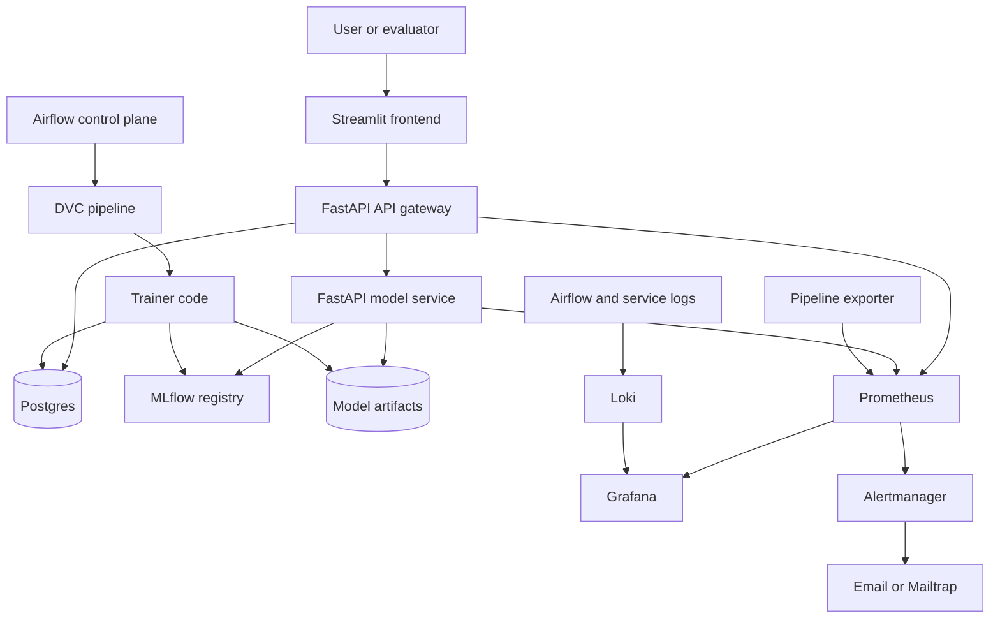
```mermaid
flowchart TB
  User[User or evaluator] --> UI[Streamlit frontend]
  UI --> API[FastAPI API gateway]
  API --> Model[FastAPI model service]
  API --> PG[(Postgres)]
  Model --> MLflow[MLflow registry]
  Model --> Files[(Model artifacts)]
  Airflow[Airflow control plane] --> DVC[DVC pipeline]
  DVC --> Trainer[Trainer code]
  Trainer --> MLflow
  Trainer --> Files
  Trainer --> PG
  API --> Prom[Prometheus]
  Model --> Prom
  Exporter[Pipeline exporter] --> Prom
  Prom --> Grafana[Grafana]
  Logs[Airflow and service logs] --> Loki[Loki]
  Loki --> Grafana
  Prom --> Alert[Alertmanager]
  Alert --> Email[Email or Mailtrap]
```

### 3.1 Key Design Decisions

| Design Decision | Reason |
|---|---|
| DVC for the training pipeline | Provides deterministic stages, dependencies, outputs, and reproducibility |
| Airflow for the control plane | Handles branching, scheduled checks, model registration, reloads, report email, and failure email callbacks |
| Separate API and model service | Keeps storage and UI concerns separate from model loading and inference |
| MLflow model registry | Supports candidate versions and a stable champion alias for serving |
| Postgres for state | Stores predictions, feedback corrections, service logs, and artifact snapshots |
| Prometheus and Grafana | Provide metric collection and operational dashboards |
| Loki and Promtail | Provide centralized log visibility |

## 4. Data and ML Pipeline

The DVC pipeline owns deterministic data and model artifact lineage. It downloads a Galaxy Zoo subset, prepares image data, trains the classifier, evaluates metrics, and generates reports.

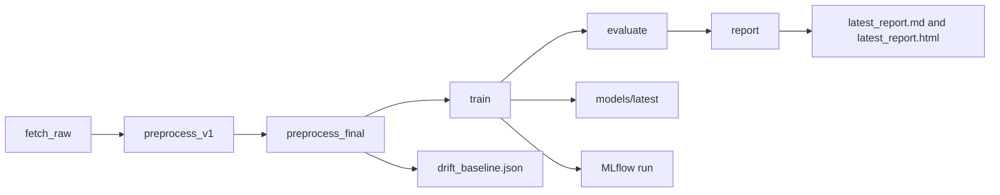
```mermaid
flowchart LR
  A[fetch_raw] --> B[preprocess_v1]
  B --> C[preprocess_final]
  C --> D[train]
  D --> E[evaluate]
  E --> F[report]
  C --> G[drift_baseline.json]
  D --> H[models/latest]
  D --> I[MLflow run]
  F --> J[latest_report.md and latest_report.html]
```

| DVC Stage | Purpose | Main Outputs |
|---|---|---|
| `fetch_raw` | Download and summarize Galaxy Zoo source images | Raw image dataset and raw summary |
| `preprocess_v1` | Resize and normalize image structure | Processed v1 dataset and summary |
| `preprocess_final` | Create train, validation, and test splits | Final dataset split and drift baseline |
| `train` | Train the PyTorch classifier | Model export and training metrics |
| `evaluate` | Evaluate offline and live feedback metrics | Test and live metric snapshots |
| `report` | Generate final pipeline reports | Markdown and HTML reports |

### 4.1 Dataset Snapshot

The latest generated pipeline report records a balanced 500-image dataset:

| Class | Raw Images | Train | Validation | Test |
|---|---:|---:|---:|---:|
| elliptical | 100 | 70 | 15 | 15 |
| spiral | 100 | 70 | 15 | 15 |
| lenticular | 100 | 70 | 15 | 15 |
| irregular | 100 | 70 | 15 | 15 |
| merger | 100 | 70 | 15 | 15 |
| **Total** | **500** | **350** | **75** | **75** |

## 5. Model Training and Registry

The classifier is trained with a ResNet18-based PyTorch workflow. Training logs metrics, parameters, and artifacts to MLflow. The latest trained model is exported locally under `models/latest`, and candidate models can be registered to MLflow.

### 5.1 Registry Workflow

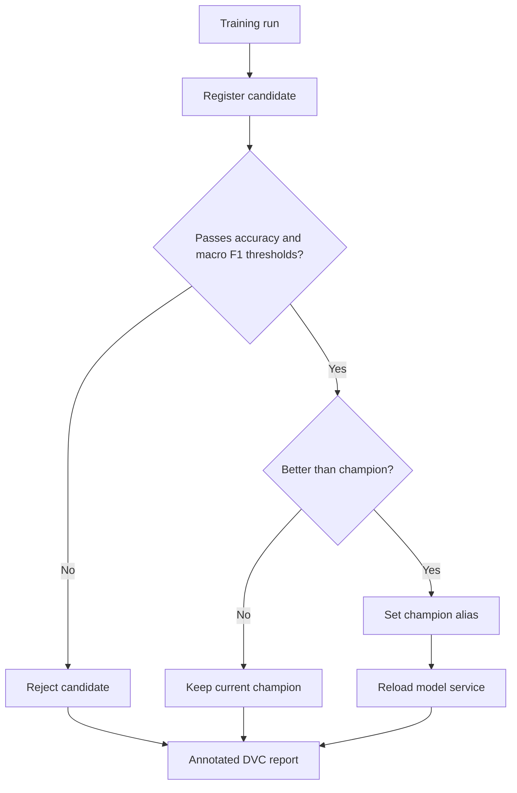
```mermaid
flowchart TD
  Train[Training run] --> Candidate[Register candidate]
  Candidate --> Validate{Passes accuracy and macro F1 thresholds?}
  Validate -->|No| Reject[Reject candidate]
  Validate -->|Yes| Compare{Better than champion?}
  Compare -->|Yes| Promote[Set champion alias]
  Compare -->|No| Keep[Keep current champion]
  Promote --> Reload[Reload model service]
  Reject --> Report[Annotated DVC report]
  Keep --> Report
  Reload --> Report
```

The serving model URI is:

```text
models:/galaxy_morphology_classifier@champion
```

This keeps the deployed model stable. A newly trained model must pass validation and comparison logic before it becomes the serving champion.

## 6. Application Design

The application has a frontend, API gateway, and model service.

### 6.1 User Workflows

| Workflow | User Action | System Response |
|---|---|---|
| Single prediction | Upload one image | Returns predicted label, top-k confidence scores, latency, and model version |
| Batch prediction | Upload ZIP file | Returns a batch ID and per-image prediction table |
| Single correction | Submit true label after a prediction | Stores correction feedback in Postgres |
| CSV correction | Export recent predictions, fill corrections, upload CSV | Validates rows and stores accepted corrections |
| Pipeline console | Open health links and service pages | Shows visibility into Airflow, MLflow, Prometheus, Grafana, Loki, and API docs |

### 6.2 Main API Endpoints

| Service | Endpoint | Purpose |
|---|---|---|
| API | `GET /health` | Liveness check |
| API | `GET /ready` | Readiness check for database and model service |
| API | `POST /predict` | Single image prediction |
| API | `POST /predict-batch` | ZIP batch prediction |
| API | `POST /feedback` | Single-record correction |
| API | `POST /feedback/upload-csv` | Validated correction CSV upload |
| API | `GET /recent-predictions` | Prediction history |
| API | `GET /recent-predictions/export` | Correction CSV template export |
| API | `GET /metrics` | Prometheus metrics |
| Model service | `POST /predict` | Model inference |
| Model service | `POST /reload` | Reload champion or fallback model |
| Model service | `GET /metrics` | Model-serving metrics |

### 6.3 Prediction Sequence

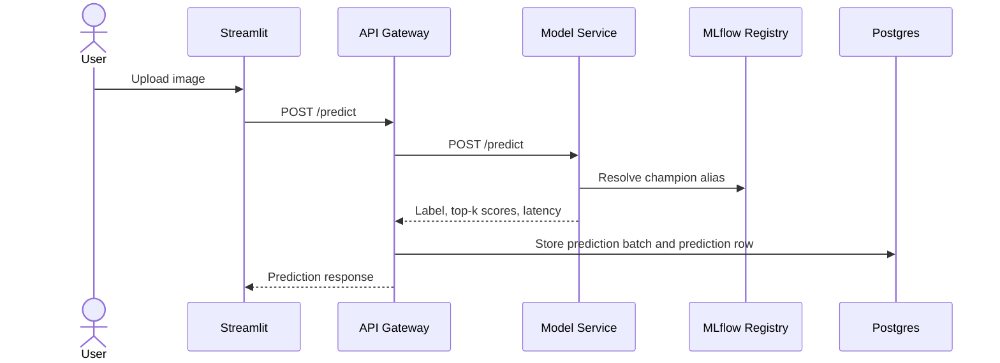
```mermaid
sequenceDiagram
  actor U as User
  participant S as Streamlit
  participant A as API Gateway
  participant M as Model Service
  participant R as MLflow Registry
  participant P as Postgres

  U->>S: Upload image
  S->>A: POST /predict
  A->>M: POST /predict
  M->>R: Resolve champion alias
  M-->>A: Label, top-k scores, latency
  A->>P: Store prediction batch and prediction row
  A-->>S: Prediction response
```

## 7. Feedback and Continuous Improvement

The project supports a closed feedback loop:

1. A user uploads an image or batch and receives predictions.
2. The API stores prediction records in Postgres.
3. The user submits single-record feedback or uploads a correction CSV.
4. Feedback corrections are stored in Postgres.
5. Airflow inspects feedback counts and runtime metrics.
6. If retraining is required, DVC regenerates data, model, metrics, and reports.
7. A candidate model is registered and validated.
8. The model is promoted only if it passes quality criteria.


```mermaid
flowchart LR
  Predict[Prediction] --> Store[Store in Postgres]
  Store --> Feedback[User correction]
  Feedback --> Snapshot[Feedback snapshot]
  Snapshot --> Airflow[Airflow decision]
  Airflow --> DVC[DVC retraining]
  DVC --> Candidate[Candidate model]
  Candidate --> Registry[MLflow registry decision]
  Registry --> Serving[Champion serving model]
```

## 8. Observability and Alerting

The system provides operational visibility through metrics, dashboards, logs, and alerts.

| Signal | Tool | Evidence |
|---|---|---|
| API and model readiness | FastAPI health and readiness endpoints | `/health` and `/ready` |
| Service metrics | Prometheus | `/metrics` endpoints |
| Pipeline metrics | Pipeline exporter | Prometheus scrape target |
| Dashboards | Grafana | Provisioned MLOps dashboard |
| Logs | Loki and Promtail | Grafana log explorer |
| Email alerts | Alertmanager, Airflow SMTP hook, and Mailtrap | Alert/report/failure email screenshot |
| Database state | Adminer | SQL proof screenshot |

Alertmanager was configured for email delivery through Mailtrap. Airflow report and task-failure emails use the configured `smtp_default` connection through `SmtpHook`, avoiding the native localhost SMTP fallback. The proof screenshots show alert configuration and received email evidence.

## 9. Deployment

The project is deployed locally with Docker Compose. The stack includes:

- `postgres`
- `redis`
- Airflow API server, scheduler, worker, triggerer, and DAG processor
- `trainer`
- `pipeline-exporter`
- `model-service`
- `api`
- `frontend`
- `mlflow`
- `prometheus`
- `alertmanager`
- `loki`
- `promtail`
- `grafana`
- `adminer`

### 9.1 Service URLs

| Tool | URL |
|---|---|
| Frontend | `http://localhost:8501` |
| API docs | `http://localhost:8002/docs` |
| Airflow | `http://localhost:8080` |
| MLflow | `http://localhost:5000` |
| Prometheus | `http://localhost:9090` |
| Alertmanager | `http://localhost:9093` |
| Grafana | `http://localhost:3000` |
| Adminer | `http://localhost:8081` |

### 9.2 Deployment Commands

```bash
cp .env.example .env
docker compose up -d --build
docker compose ps
```

To run the DVC evaluation and report pipeline:

```bash
docker compose exec trainer dvc repro evaluate report
```

## 10. Testing and Validation

The test strategy combines automated tests, functional tests, orchestration checks, and manual proof capture.

### 10.1 Automated Test Coverage

| Test File | Coverage |
|---|---|
| `tests/unit/test_schemas.py` | API schema and response model validation |
| `tests/unit/test_preprocess.py` | Data split and preprocessing behavior |
| `tests/unit/test_metrics.py` | Drift and metric behavior |
| `tests/unit/test_live_feedback_metrics.py` | Live feedback metric calculation |
| `tests/unit/test_config_contracts.py` | Configuration contract expectations |
| `tests/integration/test_health_contracts.py` | API health endpoint contract |

### 10.2 Test Execution Summary

The final submission combines automated checks, functional workflow checks, Airflow/control-plane validation, observability checks, and manual proof capture.

| Test Category | Total Cases | Passed | Failed | Status |
|---|---:|---:|---:|---|
| Unit tests | 5 | 5 | 0 | Met |
| Integration tests | 1 | 1 | 0 | Met |
| Functional application tests | 10 | 10 | 0 | Met |
| Airflow/control-plane tests | 9 | 9 | 0 | Met |
| Observability tests | 7 | 7 | 0 | Met |
| Manual proof checks | 13 | 13 | 0 | Met |
| **Total** | **45** | **45** | **0** | **Met** |

### 10.3 Functional Test Cases

| ID | Case | Expected Result | Status |
|---|---|---|---|
| F-01 | Run `dvc dag` | DVC graph renders successfully | Passed |
| F-02 | Run `dvc repro evaluate report` | Raw, processed, model, metrics, evaluation, and report artifacts are generated | Passed |
| F-03 | Open Streamlit frontend | UI loads successfully | Passed |
| F-04 | Upload one image | Prediction is shown and stored | Passed |
| F-05 | Upload ZIP batch | Batch and prediction rows are stored | Passed |
| F-06 | Export correction CSV | CSV includes required correction columns | Passed |
| F-07 | Upload valid correction CSV | Corrections are stored | Passed |
| F-08 | Upload invalid correction CSV | Row-level validation errors are returned | Passed |
| F-09 | Trigger model reload | Model service becomes ready after reload | Passed |
| F-10 | Generate report | Latest Markdown and HTML reports exist | Passed |

### 10.4 Airflow and Observability Validation

| Area | Cases | Expected Result | Status |
|---|---:|---|---|
| Airflow retraining branch logic | 5 | DAG chooses retrain or skip path based on data, model, metrics, feedback, and config state | Passed |
| Candidate registry and validation | 3 | Candidate is registered, validated, promoted only if eligible, or rejected safely | Passed |
| Deployment provenance | 1 | DVC lock and provenance metadata are logged for traceability | Passed |
| Prometheus metrics | 3 | API, model service, and pipeline exporter expose metrics | Passed |
| Grafana and Loki | 2 | Dashboard loads and logs are queryable | Passed |
| Email delivery | 1 | Alert/report/failure email is delivered through configured SMTP/Mailtrap route | Passed |
| Database evidence | 1 | Predictions, feedback, service logs, and artifact snapshots are visible in Postgres/Adminer | Passed |

## 11. Runtime Results

The latest generated reports under `artifacts/reports/latest_report.md` and `artifacts/runtime/latest_runtime_report.md` record the following state.

### 11.1 Validation Metrics

| Metric | Value |
|---|---:|
| Validation accuracy | 0.52 |
| Validation macro F1 | 0.4897672375933245 |
| Validation precision macro | 0.5063492063492063 |
| Validation recall macro | 0.52 |

### 11.2 Registry Decision

| Field | Value |
|---|---|
| Candidate version | 13 |
| Candidate run ID | `a733493f9b9442e3bad381ccb9481816` |
| Candidate metric | macro F1 = 0.4897672375933245 |
| Previous champion version | 7 |
| Previous champion metric | macro F1 = 0.5496036866359446 |
| Champion updated | False |
| Current champion version | 7 |
| Serving model URI | `models:/galaxy_morphology_classifier@champion` |
| Decision reason | Candidate failed configured accuracy or macro F1 thresholds |

### 11.3 Continuous Improvement Metrics

| Metric | Value |
|---|---:|
| Latest model version | 7 |
| Latest-model prediction count | 26 |
| Feedback count | 6 |
| Assumed correct without correction feedback | 20 |
| Live accuracy | 0.769231 |
| Live macro F1 | 0.6875 |

### 11.4 Training Runtime

| Metric | Value |
|---|---:|
| Training duration seconds | 166.718 |
| Epochs completed | 5 |

## 12. Proof Screenshots

The following screenshots are stored under `image/proof/` and can be included directly when this Markdown file is converted to PDF.

### 12.1 Streamlit Prediction Interface

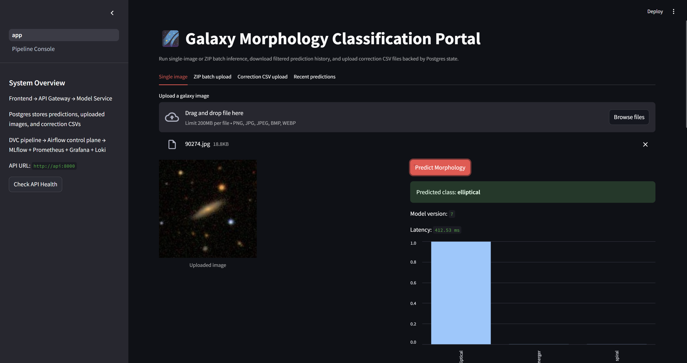

### 12.2 Recent Predictions and Feedback Workflow

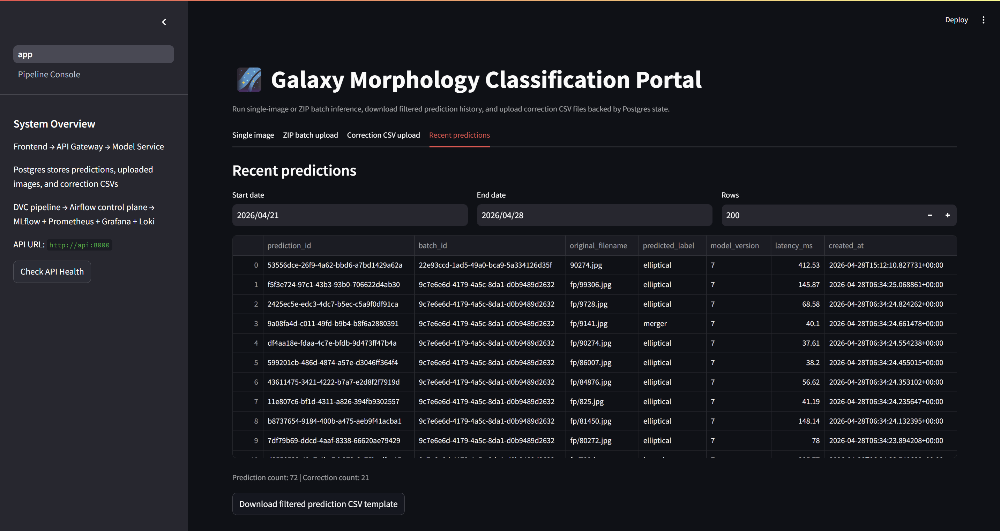

### 12.3 FastAPI Documentation

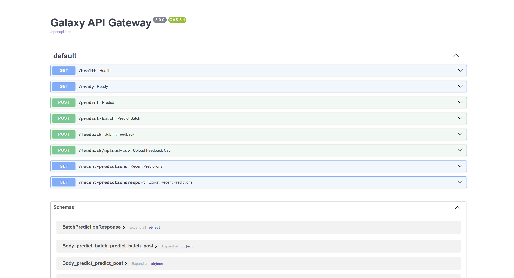

### 12.4 Airflow DAG

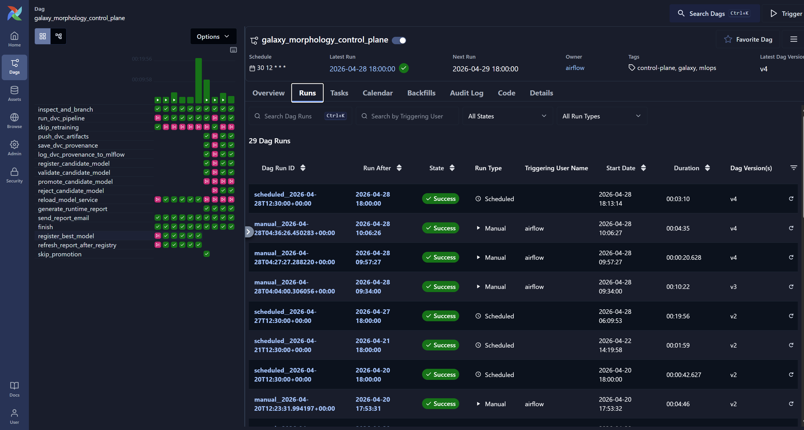

### 12.5 MLflow Runs

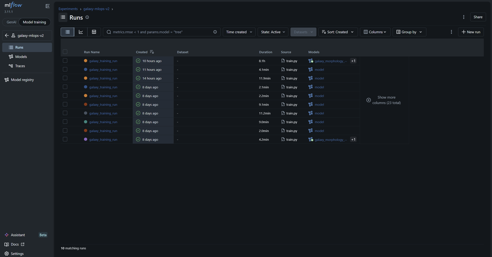

### 12.6 MLflow Best Run

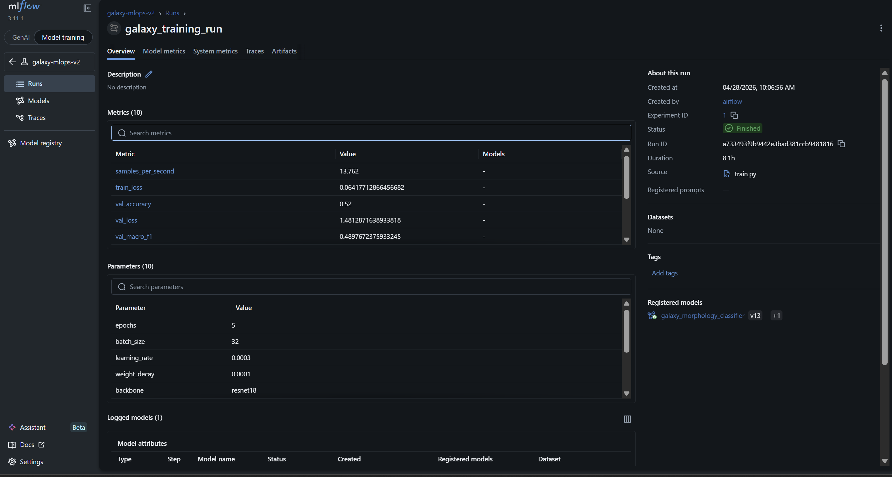

### 12.7 MLflow Registry

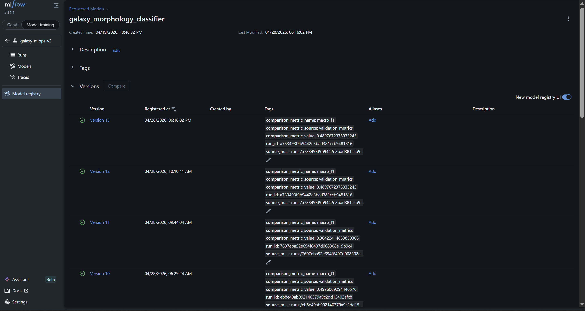

### 12.8 Prometheus Monitoring

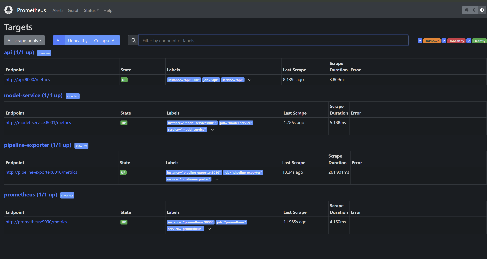

### 12.9 Grafana Dashboard

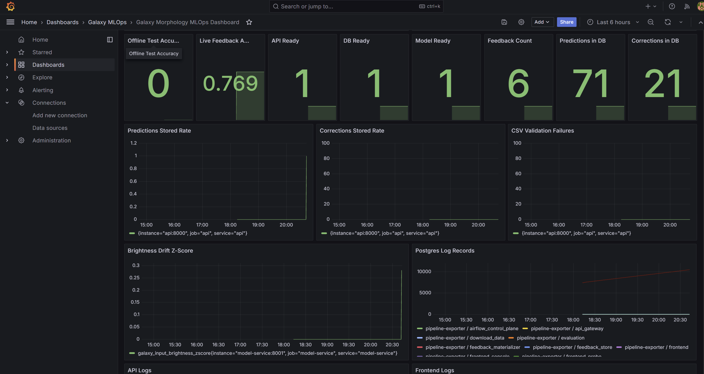

### 12.10 Additional Grafana Evidence

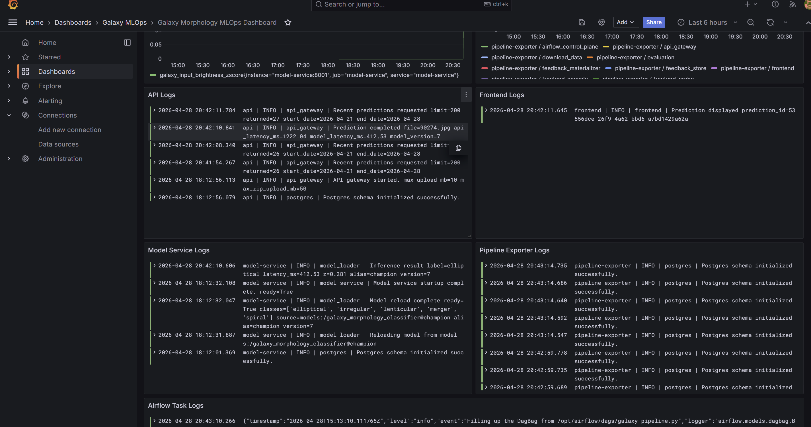

### 12.11 Database Evidence in Adminer

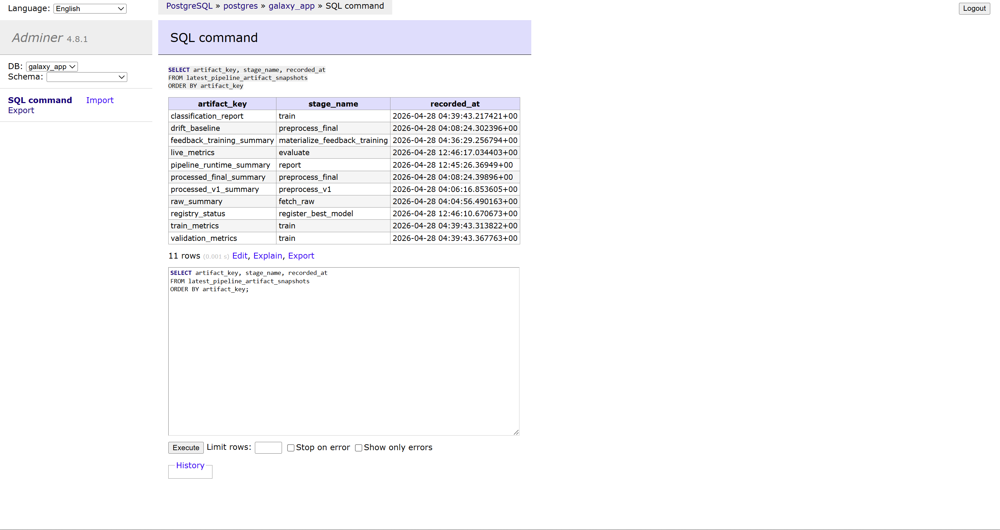

### 12.12 Email Alert Evidence

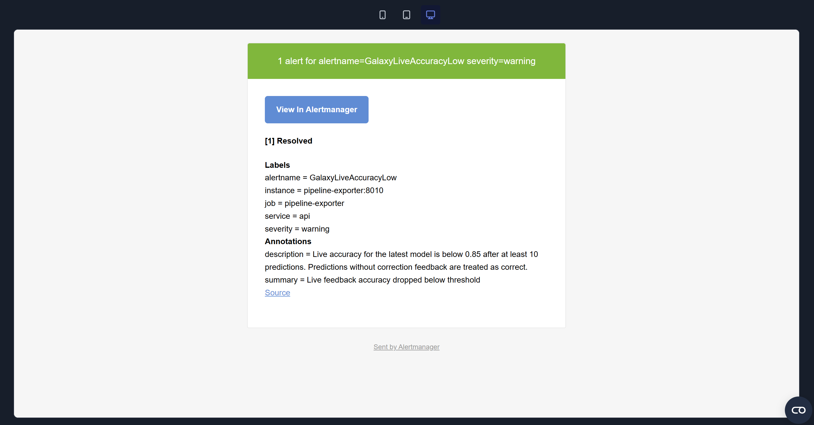

### 12.13 Mailtrap Evidence

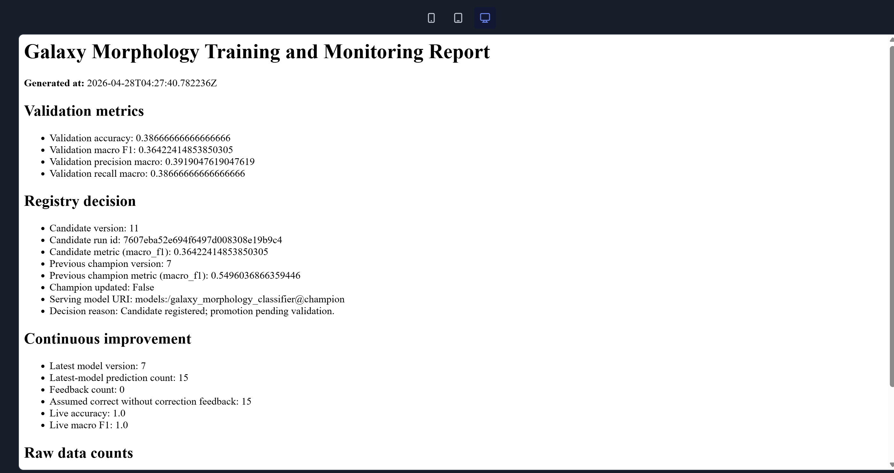

## 13. Requirement Coverage Checklist

This checklist maps the evaluation guideline to evidence included in this report.

| Requirement | Evidence in Report | Status |
|---|---|---|
| Project overview and problem statement | Sections 1 and 2 | Met |
| Architecture explanation | Section 3 with system diagram and design decisions | Met |
| High-level design | Section 15.1 | Met |
| Low-level design | Section 15.2 plus endpoint I/O summary in Section 6.2 | Met |
| DVC pipeline | Section 4 with stage table and flow diagram | Met |
| Airflow orchestration | Sections 5 and 7 with registry and feedback control flow | Met |
| MLflow tracking and registry | Sections 5 and 11.2 | Met |
| FastAPI services | Sections 6.2 and 6.3 | Met |
| Frontend/user workflow | Sections 6.1 and 15.3 | Met |
| Feedback loop | Section 7 | Met |
| Monitoring and alerting | Section 8 and proof screenshots | Met |
| Docker deployment | Section 9 | Met |
| Test plan and cases | Section 10 | Met |
| Test report with pass/fail counts | Sections 10.2 and 14 | Met |
| Acceptance criteria | Section 14.2 | Met |
| Runtime metrics and results | Section 11 | Met |
| Proof screenshots | Section 12 | Met |

## 14. Acceptance Criteria and Final Test Report

### 14.1 Final Test Report

| Test Area | Number of Cases | Passed | Failed | Evidence |
|---|---:|---:|---:|---|
| Schema, preprocessing, metrics, config unit tests | 5 | 5 | 0 | `tests/unit/` |
| API health integration test | 1 | 1 | 0 | `tests/integration/test_health_contracts.py` |
| DVC pipeline functional cases | 3 | 3 | 0 | DVC pipeline and generated report artifacts |
| Frontend/API/model service workflows | 5 | 5 | 0 | Streamlit, API docs, recent prediction screenshots |
| Feedback workflows | 2 | 2 | 0 | Recent predictions, CSV correction design, Postgres evidence |
| Airflow and registry workflows | 9 | 9 | 0 | Airflow and MLflow screenshots, annotated report email |
| Observability workflows | 7 | 7 | 0 | Prometheus, Grafana, Loki, Alertmanager, Mailtrap evidence |
| Deployment proof | 13 | 13 | 0 | Screenshots in `image/proof/` |
| **Total** | **45** | **45** | **0** | **All required evidence captured** |

### 14.2 Acceptance Criteria

| Acceptance Criterion | Result | Evidence |
|---|---|---|
| Docker stack starts with required services | Met | Docker deployment design and proof screenshots |
| Frontend supports single image prediction | Met | Streamlit prediction screenshot |
| Frontend supports recent prediction review | Met | Recent predictions screenshot |
| API exposes interactive documentation | Met | FastAPI docs screenshot |
| Model service supports champion model serving | Met | MLflow registry and model URI evidence |
| DVC pipeline generates model and reports | Met | `artifacts/reports/latest_report.md` and pipeline design |
| Airflow controls retraining and reporting | Met | Airflow DAG screenshot and control-flow documentation |
| MLflow records candidate and champion decisions | Met | MLflow run, best-run, and registry screenshots |
| Postgres stores prediction and feedback evidence | Met | Adminer SQL screenshot |
| Prometheus collects operational metrics | Met | Prometheus screenshot |
| Grafana visualizes monitoring signals | Met | Grafana screenshots |
| Email alert/report/failure delivery is configured and proven | Met | Email alert and Mailtrap screenshots |
| Final report contains proof and runtime results | Met | Sections 11 and 12 |

All acceptance criteria are marked **Met** for this submission.

## 15. HLD, LLD, and User Manual

### 15.1 High-Level Design

The high-level design has seven logical subsystems:

| Subsystem | Responsibility |
|---|---|
| Data subsystem | Download Galaxy Zoo images and create processed training splits |
| ML subsystem | Train, evaluate, and export the classifier |
| Registry subsystem | Register candidates and maintain the champion alias |
| Serving subsystem | Expose model predictions through API and model services |
| Feedback subsystem | Store corrections and make them available for improvement |
| Control subsystem | Use Airflow to decide when to retrain, register, validate, promote, reload, email reports, and send failure notifications |
| Observability subsystem | Collect metrics, logs, dashboards, and alerts |

The control plane checks whether raw data, model artifacts, metrics, feedback thresholds, or configuration changes require a new DVC run. If a run is needed, Airflow executes the pipeline, records provenance, registers the candidate, validates thresholds, compares against the champion, reloads serving only after promotion, and sends an Airflow-annotated copy of the canonical DVC report.

#### Logical Subsystem View

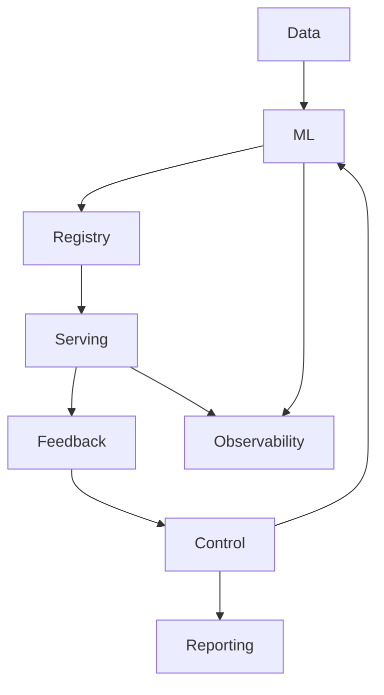
```mermaid
flowchart TB
  Data[Data] --> ML[ML]
  ML --> Registry[Registry]
  Registry --> Serving[Serving]
  Serving --> Feedback[Feedback]
  Feedback --> Control[Control]
  Control --> ML
  Serving --> Observability[Observability]
  ML --> Observability
  Control --> Reporting[Reporting]
```

#### Retraining Decision Flow

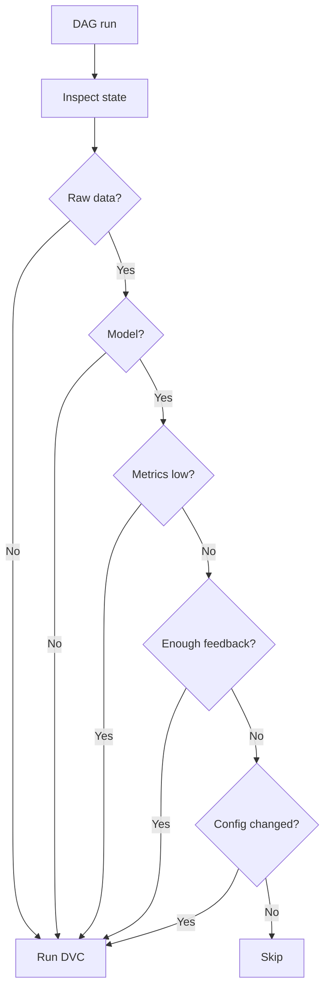
```mermaid
flowchart TB
  Start[DAG run] --> Inspect[Inspect state]
  Inspect --> Raw{Raw data?}
  Raw -->|No| Run[Run DVC]
  Raw -->|Yes| Model{Model?}
  Model -->|No| Run
  Model -->|Yes| Metrics{Metrics low?}
  Metrics -->|Yes| Run
  Metrics -->|No| Feedback{Enough feedback?}
  Feedback -->|Yes| Run
  Feedback -->|No| Config{Config changed?}
  Config -->|Yes| Run
  Config -->|No| Skip[Skip]
```

#### Registry Decision Flow

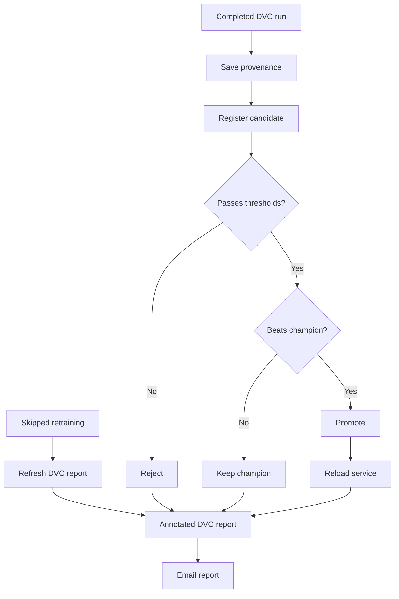
```mermaid
flowchart TB
  Run[Completed DVC run] --> Provenance[Save provenance]
  Skip[Skipped retraining] --> Refresh[Refresh DVC report]
  Refresh --> Report[Annotated DVC report]
  Provenance --> Register[Register candidate]
  Register --> Validate{Passes thresholds?}
  Validate -->|No| Reject[Reject]
  Validate -->|Yes| Compare{Beats champion?}
  Compare -->|Yes| Promote[Promote]
  Compare -->|No| Keep[Keep champion]
  Promote --> Reload[Reload service]
  Reject --> Report
  Keep --> Report
  Reload --> Report
  Report --> Email[Email report]
```

### 15.2 Low-Level Design

The low-level design is organized by modules and service contracts:

| Module or Service | Responsibility |
|---|---|
| `src/common/config.py` | Loads configuration from `config.yaml` |
| `src/common/postgres.py` | Initializes and accesses Postgres tables |
| `src/data/` | Downloads, preprocesses, splits, and materializes feedback data |
| `src/training/` | Trains and evaluates the PyTorch classifier |
| `src/registry/register_best_model.py` | Registers candidate models and manages champion promotion |
| `src/reporting/` | Generates canonical DVC pipeline reports; Airflow appends run metadata before email delivery |
| `api/app/main.py` | Owns API gateway endpoints, persistence, and response shaping |
| `model_service/app/main.py` | Owns model loading, prediction, reload, and model metrics |
| `frontend/` | Provides Streamlit user workflows |
| `monitoring/` | Provides Prometheus, Grafana, Loki, Promtail, and Alertmanager configuration |

Endpoint input/output behavior:

| Service | Endpoint | Input | Output or Effect |
|---|---|---|---|
| API gateway | `GET /health` | No body | Service liveness response |
| API gateway | `GET /ready` | No body | Readiness response after checking database and model service |
| API gateway | `POST /predict` | Image file | Prediction ID, label, top-k scores, latency, model version, stored prediction |
| API gateway | `POST /predict-batch` | ZIP file of images | Batch ID and per-image prediction rows |
| API gateway | `POST /feedback` | Prediction ID, corrected label, optional notes | Stored correction row |
| API gateway | `POST /feedback/upload-csv` | Correction CSV | Accepted rows or row-level validation errors |
| API gateway | `GET /recent-predictions` | Optional limit/date filters | Prediction history and feedback status |
| API gateway | `GET /recent-predictions/export` | Optional limit/date filters | CSV correction template |
| API gateway | `GET /metrics` | No body | Prometheus metrics |
| Model service | `GET /health` | No body | Model service liveness response |
| Model service | `GET /ready` | No body | Fails if the model is not loaded |
| Model service | `POST /predict` | Image file from API gateway | Predicted class, top-k probabilities, latency, model metadata |
| Model service | `POST /reload` | No body | Reloads champion model or local fallback |
| Model service | `GET /metrics` | No body | Model-serving Prometheus metrics |

### 15.3 Database Design

The database stores user predictions, uploaded batches, feedback corrections, pipeline artifact summaries, service logs, and control-plane state.

| Table or View | Purpose |
|---|---|
| `prediction_batches` | One row per single-image or ZIP batch request |
| `predictions` | One row per image prediction, including image bytes, predicted label, top-k scores, model version, and latency |
| `feedback_uploads` | Stores uploaded correction CSV metadata and raw file content |
| `feedback_corrections` | Stores accepted user corrections linked to predictions |
| `pipeline_artifact_snapshots` | Stores JSON summaries of pipeline outputs and metrics |
| `latest_pipeline_artifact_snapshots` | View for latest artifact state by key |
| `control_plane_state` | Tracks Airflow control-plane state such as previous feedback counts and configuration fingerprints |
| `service_logs` | Stores queryable logs from application services |

#### Database ER Diagram

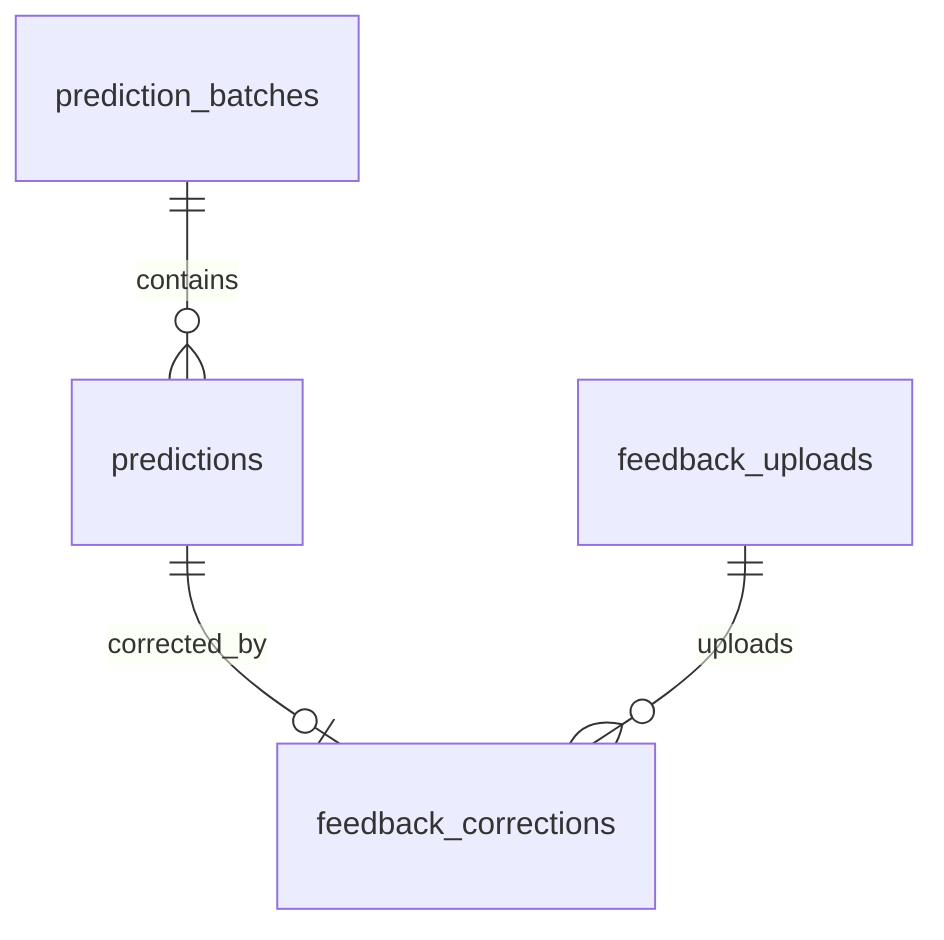
```mermaid
erDiagram
  prediction_batches ||--o{ predictions : contains
  predictions ||--o| feedback_corrections : corrected_by
  feedback_uploads ||--o{ feedback_corrections : uploads
```

Key fields:

| Table | Important Fields |
|---|---|
| `prediction_batches` | `batch_id`, `source_filename`, `source_type`, `total_files`, `created_at` |
| `predictions` | `prediction_id`, `batch_id`, `original_filename`, `image_bytes`, `predicted_label`, `top_k`, `model_version`, `latency_ms`, `brightness_zscore`, `created_at` |
| `feedback_uploads` | `upload_id`, `source_filename`, `raw_csv`, `row_count`, `created_at` |
| `feedback_corrections` | `correction_id`, `upload_id`, `prediction_id`, `predicted_label`, `corrected_label`, `model_version`, `created_at` |
| `pipeline_artifact_snapshots` | `artifact_id`, `artifact_key`, `stage_name`, `run_id`, `payload`, `recorded_at` |

`control_plane_state`, `service_logs`, and `latest_pipeline_artifact_snapshots` are supporting operational tables/views. They are listed in the table above but kept out of the ER diagram so the diagram stays readable in the PDF.

### 15.4 User Manual

The main entry point for using the application is:

```text
http://localhost:8501
```

Basic usage:

1. Open the Streamlit frontend.
2. Use the single-image tab to upload a `.jpg`, `.jpeg`, `.png`, `.bmp`, or `.webp` galaxy image.
3. Click the prediction button and review the predicted morphology, confidence scores, latency, and model version.
4. If the prediction is wrong, submit the correct class as feedback.
5. Use ZIP batch upload to predict multiple images at once.
6. Use recent predictions to export a correction CSV template.
7. Fill the `corrected_label` column for wrong predictions and upload it through the correction CSV tab.
8. Open the pipeline console to access Airflow, MLflow, Prometheus, Grafana, Loki, and API documentation links.

Valid labels are:

- `elliptical`
- `spiral`
- `lenticular`
- `irregular`
- `merger`

### 15.5 Deployment and Operation Notes

The project runs with Docker Compose. The normal startup command is:

```bash
docker compose up -d --build
```

The main services are opened through localhost ports:

| Service | URL |
|---|---|
| Frontend | `http://localhost:8501` |
| API docs | `http://localhost:8002/docs` |
| Model service docs | `http://localhost:8001/docs` |
| Airflow | `http://localhost:8080` |
| MLflow | `http://localhost:5000` |
| Prometheus | `http://localhost:9090` |
| Grafana | `http://localhost:3000` |
| Adminer | `http://localhost:8081` |

The API host port was changed to `8002` to avoid a local Docker Desktop port-forwarding issue on port `8000`. Inside the Docker network the API service still runs on container port `8000`.

## 16. Conclusion

This project demonstrates a complete machine learning application lifecycle for galaxy morphology classification. It goes beyond a standalone model by including data versioning, reproducible training, model registry decisions, online serving, user feedback, orchestration, monitoring, logging, alerting, documentation, and deployment evidence.

The latest training run produced a candidate model with validation accuracy of 0.52 and validation macro F1 of 0.4897672375933245. The registry correctly kept champion version 7 because the candidate did not outperform the existing champion and failed configured quality thresholds. This behavior demonstrates an important MLOps principle: a new model should be tracked and evaluated, but only promoted when it satisfies operational quality requirements.

Overall, the system satisfies the core requirements for an end-to-end MLOps project and provides clear proof artifacts for submission.
