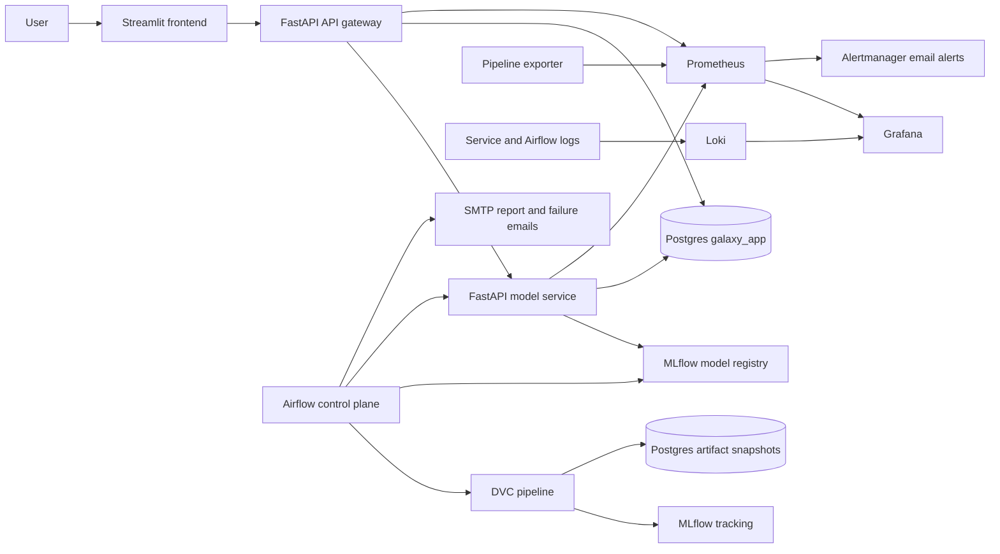
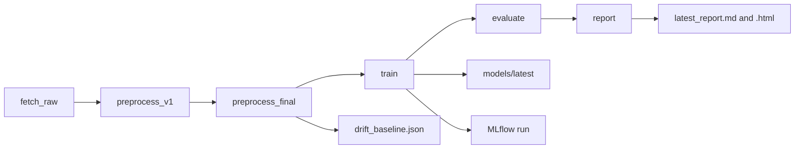
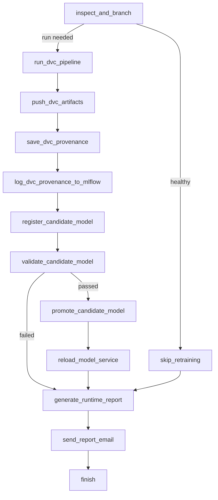
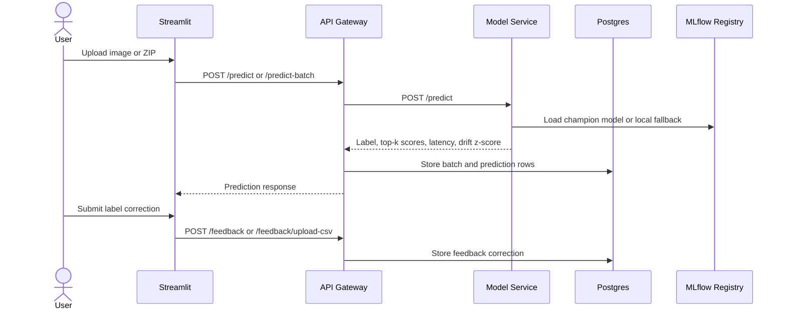

# Galaxy Morphology MLOps

End-to-end galaxy morphology classification with DVC, Airflow, FastAPI, Streamlit, MLflow, Postgres, Prometheus, Grafana, Loki, and Alertmanager.

The project classifies galaxy images into `elliptical`, `spiral`, `lenticular`, `irregular`, and `merger`. It includes reproducible data preparation, model training, registry promotion, online inference, feedback capture, feedback-aware retraining, generated reports, and operational monitoring.

`report.pdf` is included at the repository root as the submitted project report. The Markdown docs in `docs/` describe the current codebase and are easier to inspect, diff, and maintain.

## System Map



## What Is Implemented

| Area | Implementation |
|---|---|
| Reproducible ML pipeline | `dvc.yaml`, `src/data/*`, `src/training/*`, `src/reporting/generate_report.py` |
| Runtime orchestration | `airflow/dags/galaxy_pipeline.py` |
| Online serving | `api/app/main.py`, `model_service/app/main.py` |
| User interface | `frontend/app.py`, `frontend/pages/1_Pipeline_Console.py` |
| Feedback loop | Postgres-backed predictions, correction CSV upload, feedback materialization |
| Model registry | `src/registry/register_best_model.py`, MLflow champion alias |
| Monitoring | Prometheus metrics, Grafana dashboard, Loki logs, Alertmanager email, Airflow report/failure email |
| Durable metadata | Postgres tables and JSONB pipeline artifact snapshots |

## Repository Layout

```text
airflow/             Airflow image and DAGs
api/                 FastAPI API gateway
docs/                Architecture, design, testing, user, and deployment docs
frontend/            Streamlit application
model_service/       FastAPI model-serving service
monitoring/          Prometheus, Grafana, Loki, Promtail, Alertmanager config
postgres/            Database initialization scripts
requirements/        Service-specific Python dependencies
scripts/             Operational helper scripts
src/                 Data, feature, training, registry, monitoring, reporting code
tests/               Unit and integration tests
```

## DVC Pipeline



Run the full pipeline inside the trainer container:

```bash
docker compose exec trainer dvc repro report
```

## Airflow Control Plane



Airflow runs the DVC pipeline when raw data or model artifacts are missing, metrics degrade below configured thresholds, enough new feedback has arrived, or the pipeline configuration fingerprint changes. After a successful DVC run, Airflow pushes DVC artifacts to the configured remote when `dvc.push_on_success` is `true`, saves `dvc.lock` provenance under `artifacts/runtime/runs/<run_id>/`, logs `dvc.lock` and `provenance.json` to MLflow, registers a candidate, validates accuracy and macro F1 thresholds, promotes only passing candidates, and reloads serving only after promotion. The provenance JSON also records deployment metadata from `DEPLOYMENT_GIT_COMMIT_SHA`, `APP_VERSION`, `CONTAINER_IMAGE`, and `CI_RUN_ID` when those environment variables are supplied by CI/CD. DVC-owned reports stay under `artifacts/reports/`; Airflow runtime reports are generated separately under `artifacts/runtime/` and emailed with the configured `smtp_default` connection. Task-failure notifications also use the same hook-backed SMTP connection through the DAG failure callback.

To reproduce a tracked run, check out the matching code version, download that run's `dvc.lock` artifact from MLflow, replace the local root `dvc.lock`, then pull the recorded artifacts:

```bash
dvc pull
```

## Application Flow



## Main Endpoints

| Service | Endpoint | Purpose |
|---|---|---|
| API | `GET /health`, `GET /ready` | Liveness and readiness |
| API | `POST /predict` | Single image prediction |
| API | `POST /predict-batch` | ZIP batch prediction |
| API | `POST /feedback` | Single prediction correction |
| API | `POST /feedback/upload-csv` | Validated correction CSV upload |
| API | `GET /recent-predictions` | Filtered prediction history |
| API | `GET /recent-predictions/export` | CSV template export |
| Model service | `POST /predict` | Direct model inference |
| Model service | `POST /reload` | Reload champion/local model |

## Local Deployment

1. Copy and edit environment values.

```bash
cp .env.example .env
```

2. Start the stack.

```bash
docker compose up -d --build
```

3. Check services.

```bash
docker compose ps
```

## Runtime URLs

| Tool | URL |
|---|---|
| Frontend | http://localhost:8501 |
| API docs | http://localhost:8000/docs |
| Model service docs | http://localhost:8001/docs |
| Airflow | http://localhost:8080 |
| MLflow | http://localhost:5000 |
| Prometheus | http://localhost:9090 |
| Alertmanager | http://localhost:9093 |
| Grafana | http://localhost:3000 |
| Adminer | http://localhost:8081 |

## Current Run Snapshot

The latest generated report in `artifacts/reports/latest_report.md` records:

| Item | Value |
|---|---|
| Raw dataset | 500 images, 100 per class |
| Final split | 70 train, 15 validation, 15 test per class |
| Validation accuracy | 0.52 |
| Validation macro F1 | 0.4976 |
| Candidate model version | 10 |
| Champion model version | 7 |
| Registry decision | Candidate not promoted because it did not beat champion macro F1 0.5496 |
| Feedback rows | 15 |
| Training duration | 660.367 seconds, 5 epochs |

## Documentation

| Document | Contents |
|---|---|
| `docs/00_REQUIREMENT_COVERAGE.md` | Requirement coverage matrix |
| `docs/01_ARCHITECTURE.md` | System, data, serving, observability, and database architecture |
| `docs/02_HLD.md` | High-level design and control-loop behavior |
| `docs/03_LLD.md` | Low-level modules, endpoints, schemas, and artifacts |
| `docs/04_TEST_PLAN_AND_CASES.md` | Test strategy and cases |
| `docs/05_TEST_REPORT.md` | Current test report template and known verification points |
| `docs/06_USER_MANUAL.md` | Non-technical usage guide |
| `docs/07_DEPLOYMENT_RUNBOOK.md` | Deployment and operations runbook |

## Useful Commands

```bash
# Run tests locally
pytest

# Run DVC pipeline in trainer
docker compose exec trainer dvc repro report

# Push DVC artifacts to the configured remote
docker compose exec trainer dvc push

# Trigger report generation only
docker compose exec trainer python -m src.reporting.generate_report

# Trigger runtime email report generation only
docker compose exec trainer python -m src.reporting.generate_runtime_report

# Register latest candidate model
docker compose exec trainer python -m src.registry.register_best_model register-candidate
docker compose exec trainer python -m src.registry.register_best_model promote-candidate

# Tail API logs
docker compose logs -f api
```

## Proof Artifacts

Screenshots for final submission should be stored in `image/proof/`. Suggested evidence:

- Docker Compose services running
- Streamlit prediction UI
- Airflow DAG run
- MLflow experiment and model registry
- Prometheus targets or alerts
- Grafana dashboard
- Adminer SQL query over Postgres tables
- Mailtrap or SMTP email proof
- Latest generated report
