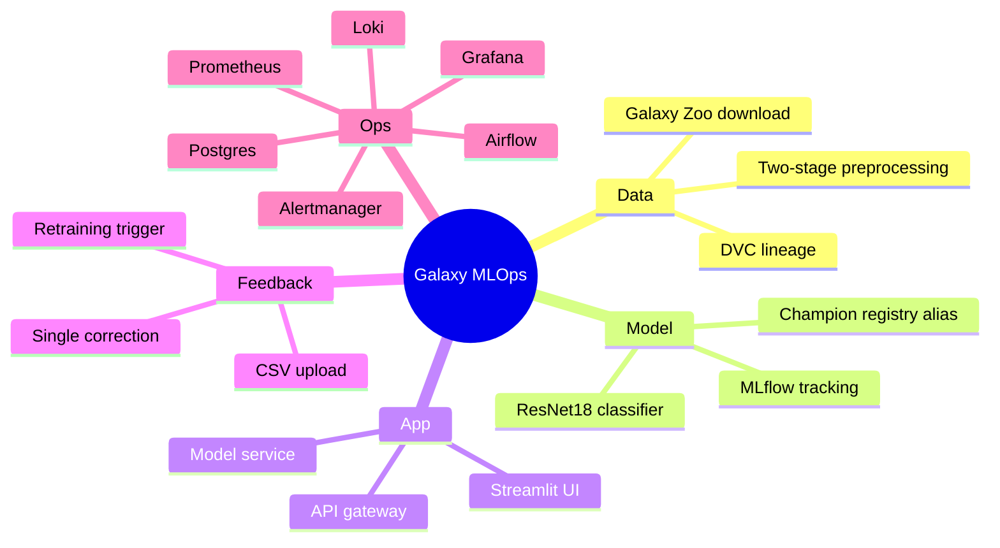
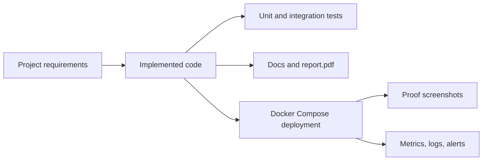

# Requirement Coverage Matrix

This document maps the submitted MLOps requirements to the current codebase. The repository also includes `report.pdf` at the root for the final report artifact.

## Coverage Summary

## Requirement Matrix

| Requirement | Status | Evidence |
|---|---:|---|
| Multi-service application | Done | `docker-compose.yml`, `frontend/`, `api/`, `model_service/` |
| Separate frontend, API, and model service | Done | `frontend/app.py`, `api/app/main.py`, `model_service/app/main.py` |
| Reproducible ML pipeline | Done | `dvc.yaml` stages from `fetch_raw` to `report` |
| Data ingestion from Galaxy Zoo | Done | `src/data/download_galaxy_zoo.py` |
| Two-stage preprocessing | Done | `src/data/preprocess_v1.py`, `src/data/preprocess_final.py` |
| Train, validate, evaluate workflow | Done | `src/training/train.py`, `src/training/evaluate.py` |
| Model experiment tracking | Done | MLflow logging in `src/training/train.py` |
| Model registry promotion | Done | `src/registry/register_best_model.py` |
| Champion model serving | Done | `MODEL_URI=models:/galaxy_morphology_classifier@champion` |
| Online single-image prediction | Done | API `POST /predict` |
| Batch prediction | Done | API `POST /predict-batch` |
| Feedback collection | Done | API `POST /feedback`, Postgres `feedback_corrections` |
| Correction CSV workflow | Done | API `POST /feedback/upload-csv`, CSV export endpoint |
| Feedback-aware retraining | Done | Airflow feedback threshold and `src/data/materialize_feedback_training.py` |
| Database-backed application state | Done | `src/common/postgres.py` |
| Pipeline artifact snapshots in database | Done | `pipeline_artifact_snapshots`, `latest_pipeline_artifact_snapshots` |
| Runtime orchestration | Done | `airflow/dags/galaxy_pipeline.py` |
| Generated reports | Done | DVC pipeline report: `src/reporting/generate_report.py`, `artifacts/reports/latest_report.*`; Airflow annotated email copy: `artifacts/runtime/latest_runtime_report.*` |
| Email delivery | Done | Airflow SMTP hook, Alertmanager SMTP config |
| Metrics | Done | `/metrics` mounts and `src/monitoring/pipeline_exporter.py` |
| Dashboards | Done | `monitoring/grafana/dashboards/galaxy_mlops_dashboard.json` |
| Log aggregation | Done | Loki and Promtail configs |
| Tests | Done | `tests/unit/*`, `tests/integration/*` |
| Deployment proof support | Done | `image/proof/README.md`, service URLs, Adminer |

## Requirement Flow

## Current Known Gaps

| Gap | Impact | Mitigation |
|---|---|---|
| Proof screenshots are manual | Final submission needs captured evidence | Save screenshots in `image/proof/` after deployment |
| Large images and model files remain filesystem artifacts | Avoids bloating Postgres | DVC and mounted volumes preserve reproducibility |
| Latest report PDF is manually supplied | Markdown/HTML reports are generated automatically | Keep `report.pdf` at root, canonical DVC reports under `artifacts/reports/`, and Airflow-annotated email copies under `artifacts/runtime/` |
