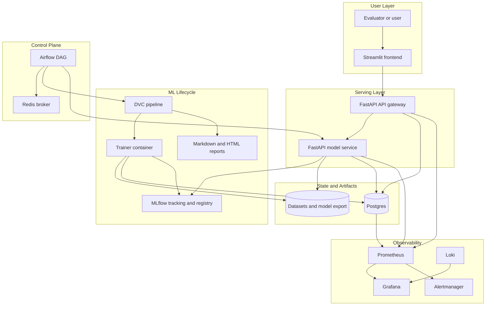
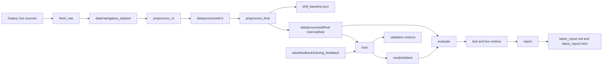
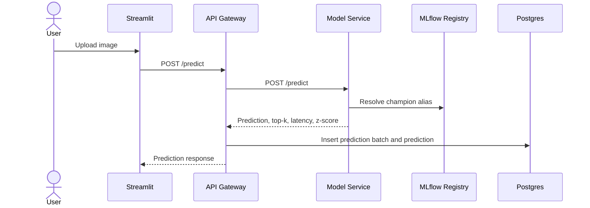
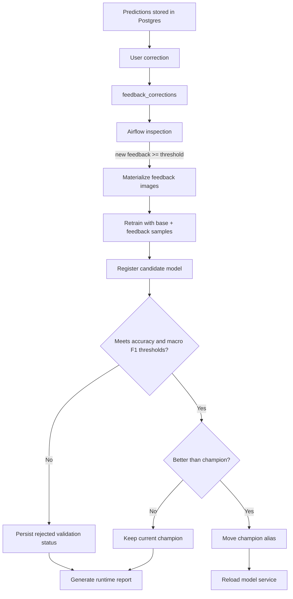
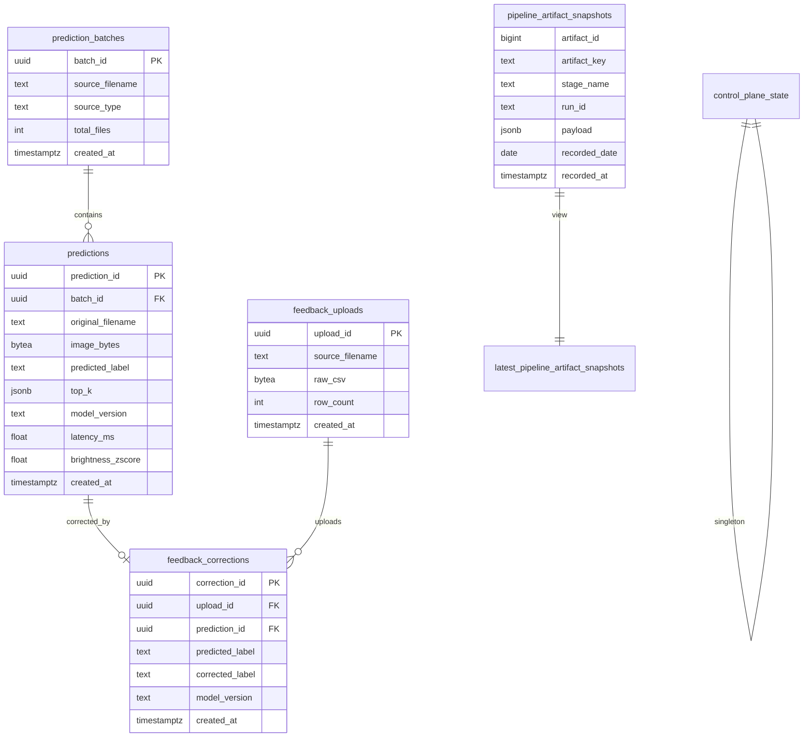
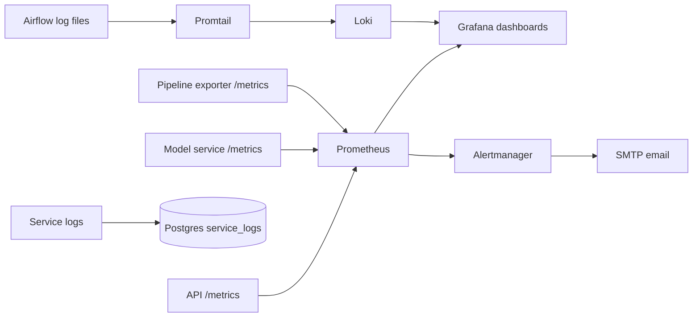

# Architecture

The project uses a two-layer MLOps architecture: DVC owns deterministic artifact lineage, while Airflow owns runtime decisions and operational actions.

## Component Architecture

## DVC Artifact Pipeline

## Serving Architecture

## Feedback and Continuous Improvement

Airflow saves the generated `dvc.lock` and `provenance.json` for each DVC run under `artifacts/runtime/runs/<airflow_run_id>/` and logs both to the corresponding MLflow run. When CI/CD supplies deployment metadata through environment variables, the provenance records the Git commit SHA, app version, container image, and CI run id, and MLflow receives matching `deployment.*` tags.

## Database Architecture

## Observability Architecture

## Artifact Storage Policy

| Artifact class | Storage |
|---|---|
| Dataset directories | Filesystem and DVC outputs |
| Model export | `models/latest`, MLflow artifacts, registry alias |
| Drift baseline | Local JSON plus Postgres snapshot |
| Metrics and summaries | Postgres JSONB snapshots |
| DVC pipeline reports | `artifacts/reports/latest_report.md` and `.html` |
| Airflow runtime reports | `artifacts/runtime/latest_runtime_report.md` and `.html` |
| Images uploaded for prediction | Postgres `BYTEA` in `predictions` |
| Feedback training images | Filesystem snapshot from accepted corrections |
