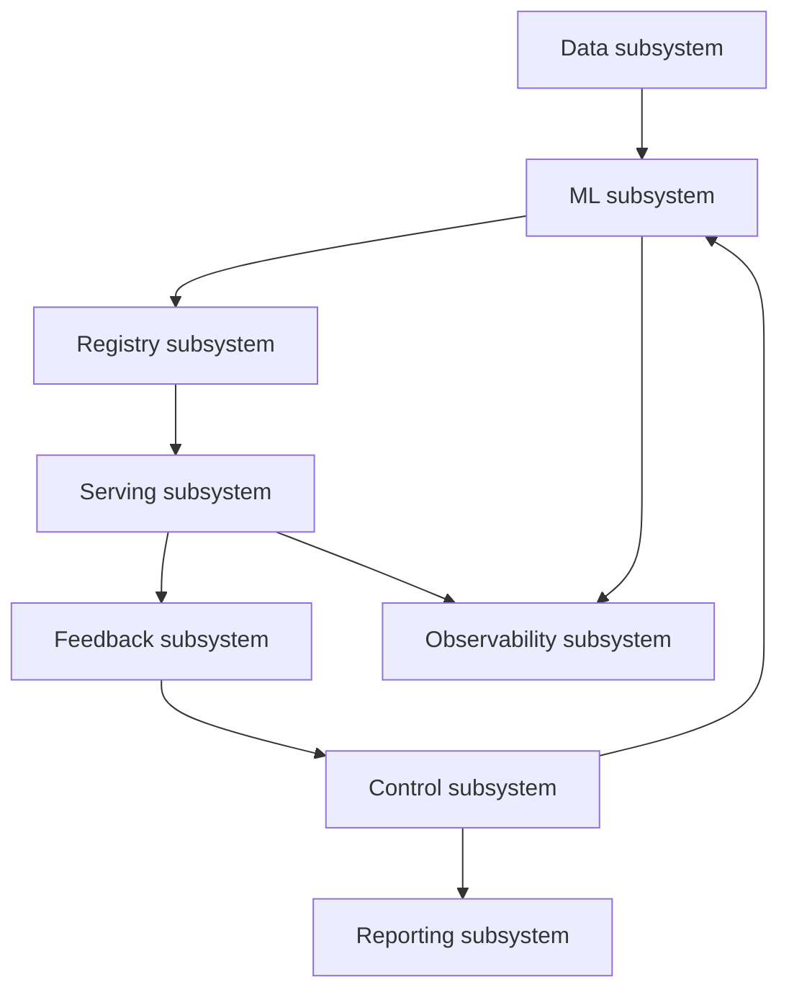
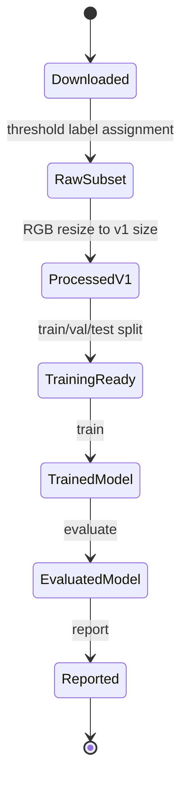
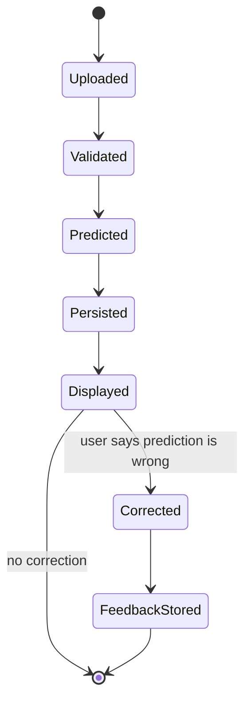
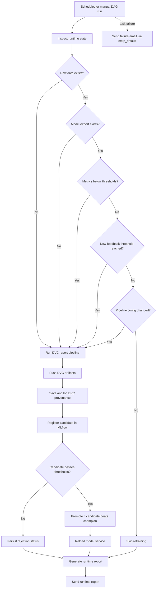
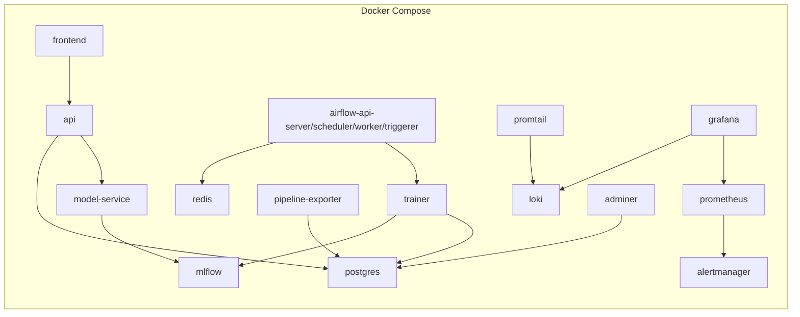

# High-Level Design

## Goal

Build a local, demonstrable MLOps platform for galaxy morphology classification that supports training, serving, feedback, retraining decisions, reporting, and monitoring.

## Logical View

## Design Decisions

| Decision | Rationale |
|---|---|
| DVC for ML stages | Gives deterministic dependencies, outputs, and rerun behavior |
| Airflow for control plane | Handles scheduled checks, branching, registry, reload, report email, and failure email callbacks |
| Postgres for state | Keeps predictions, feedback, service logs, control state, and artifact summaries durable |
| MLflow registry alias | Lets serving use `models:/galaxy_morphology_classifier@champion` |
| API gateway in front of model service | Keeps UI decoupled from model loading and storage |
| Prometheus plus Loki | Separates numeric metrics from logs while Grafana visualizes both |

## Data Lifecycle

## Inference Lifecycle

## Control-Plane Decision Logic

The DAG schedule is read from `continuous_improvement.monitor_schedule` and defaults to `30 12 * * *`; `catchup` is disabled.

## Deployment View

## Key Quality Attributes

| Attribute | Design support |
|---|---|
| Reproducibility | DVC stages and config-driven paths |
| Traceability | MLflow runs, registry status, artifact snapshots |
| Operability | Airflow branching, health endpoints, reload endpoint |
| Observability | Metrics, logs, dashboards, alert routing |
| Extensibility | Service boundaries and config-driven class/model settings |
| Demonstrability | Streamlit UI, Adminer, generated report, proof folder |
