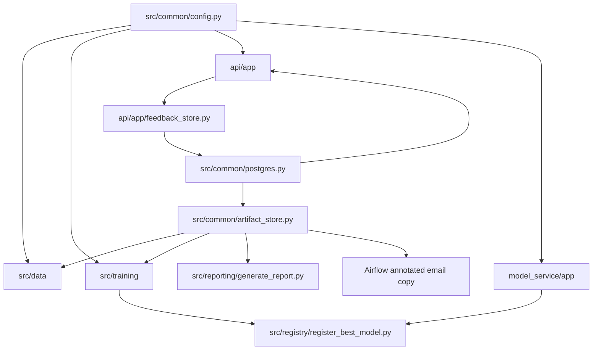
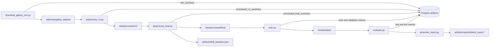
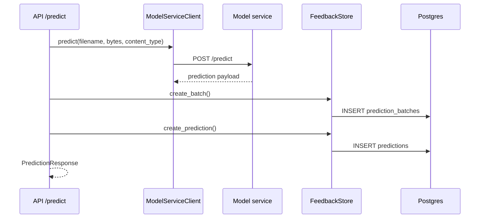
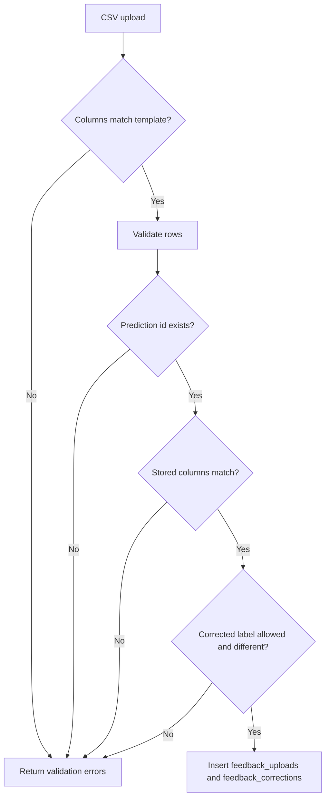
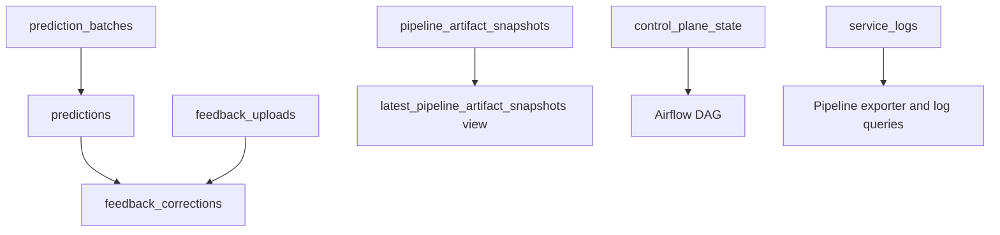
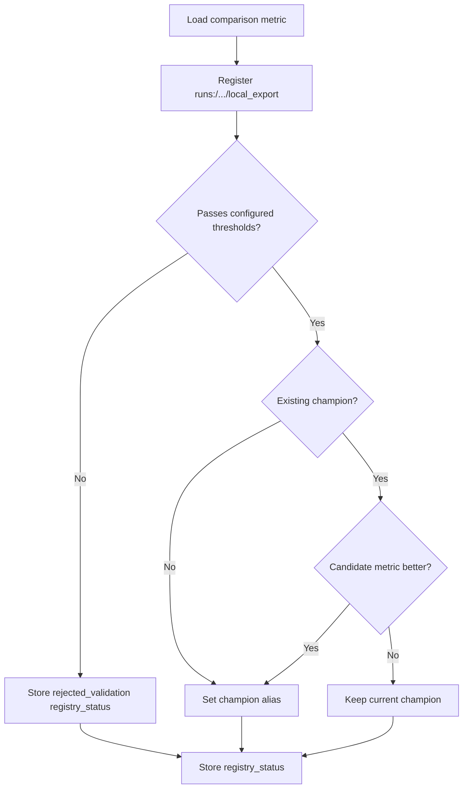

# Low-Level Design

## Module Map

## Configuration Contract

All major behavior is driven by `config.yaml`.

| Section | Used for |
|---|---|
| `project` | Project name and random seed |
| `paths` | Data, model, artifact, report, and legacy state paths |
| `runtime` | Config env names and upload limits |
| `data` | Classes, source URLs, image sizes, splits, thresholds |
| `training` | Epochs, batch size, learning rate, backbone |
| `inference` | Top-k output size |
| `continuous_improvement` | Retraining thresholds and Airflow schedule |
| `reporting` | Report title and report behavior |
| `email` | Airflow report email and failure notification settings |
| `services` | Internal service URLs |
| `registry` | MLflow model name, champion alias, comparison metric |

## DVC Stage Details

## API Gateway Endpoints

| Endpoint | Request | Response or effect |
|---|---|---|
| `GET /health` | none | `{status, service}` |
| `GET /ready` | none | Checks model service and database |
| `POST /predict` | image file | Stores one prediction and returns label, top-k, model version, latency |
| `POST /predict-batch` | ZIP file | Stores one batch and many prediction rows |
| `POST /feedback` | `prediction_id`, `ground_truth_label`, optional notes | Inserts or updates correction |
| `POST /feedback/upload-csv` | CSV file | Validates against stored predictions and inserts correction rows |
| `GET /recent-predictions` | limit/date filters | Prediction history and feedback summary |
| `GET /recent-predictions/export` | limit/date filters | CSV template for correction upload |
| `GET /metrics` | none | Prometheus metrics |

## Model Service Endpoints

| Endpoint | Behavior |
|---|---|
| `GET /health` | Basic liveness |
| `GET /ready` | Fails if no model is loaded |
| `POST /reload` | Reloads MLflow champion URI, falling back to `models/latest` |
| `POST /predict` | Runs PyTorch inference and returns top-k predictions |
| `GET /metrics` | Prometheus model metrics |

## Prediction Sequence

## CSV Feedback Validation

## Artifact Snapshot Keys

| Key | Producer | Local file kept |
|---|---|---|
| `raw_summary` | `fetch_raw` | No |
| `processed_v1_summary` | `preprocess_v1` | No |
| `processed_final_summary` | `preprocess_final` | No |
| `drift_baseline` | `preprocess_final` | Yes |
| `feedback_training_summary` | feedback materializer | No |
| `train_metrics` | `train` | No |
| `validation_metrics` | `train` | No |
| `classification_report` | `train` | No |
| `pipeline_runtime_summary` | `train` and `report` | No |
| `test_metrics` | `evaluate` | No |
| `live_metrics` | `evaluate` and annotated report email | No |
| `registry_status` | registry step | No |

`src/reporting/generate_report.py` writes the canonical DVC-owned pipeline report under `artifacts/reports/`. The Airflow DAG does not build a second independent report; `prepare_airflow_report()` reads the DVC Markdown/HTML report, appends Airflow metadata such as DAG id, run id, logical date, data interval, and `dvc.lock` SHA256, then writes email-ready copies under `artifacts/runtime/`. This keeps the emailed report aligned with the DVC-locked pipeline artifact while still adding operational context.

## Airflow Email Behavior

The DAG sends two kinds of Airflow email through the configured `email.connection_id`, which defaults to `smtp_default`.

| Email type | Implementation | Config gates |
|---|---|---|
| Report email | `send_latest_report()` emails the Airflow-annotated DVC report through `SmtpHook(smtp_conn_id=email.connection_id)` | `email.enabled` |
| Task failure email | `send_task_failure_email()` is registered as `on_failure_callback` and uses the same `SmtpHook` path | `email.enabled` and `email.email_on_failure` |

The DAG intentionally sets Airflow's native `email_on_failure` default argument to `False`. Native Airflow task emails read Airflow's global SMTP settings and may fall back to `localhost:25`; the hook-backed callback keeps failure notifications on the same tested SMTP connection as report emails.

## Database Tables

## MLflow Registry Promotion

The Airflow DAG stores `dvc.lock` and `provenance.json` after `dvc push`, then logs them to MLflow. `provenance.json` includes the DVC lock hash, Airflow run id, MLflow run id, feedback snapshot information, and optional deployment metadata sourced from `DEPLOYMENT_GIT_COMMIT_SHA`, `APP_VERSION`, `CONTAINER_IMAGE`, and `CI_RUN_ID`.
