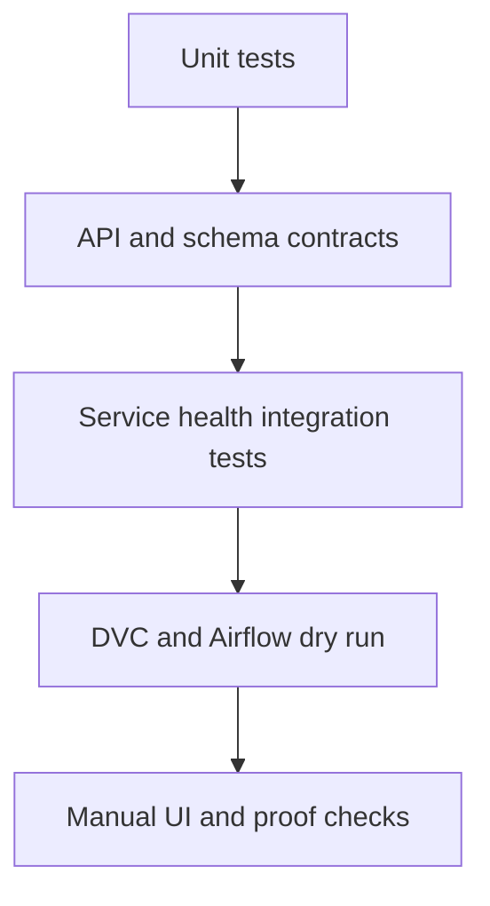
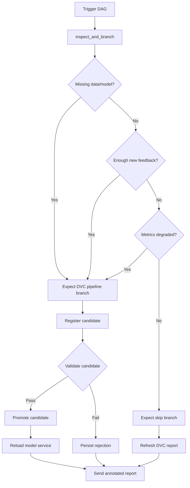
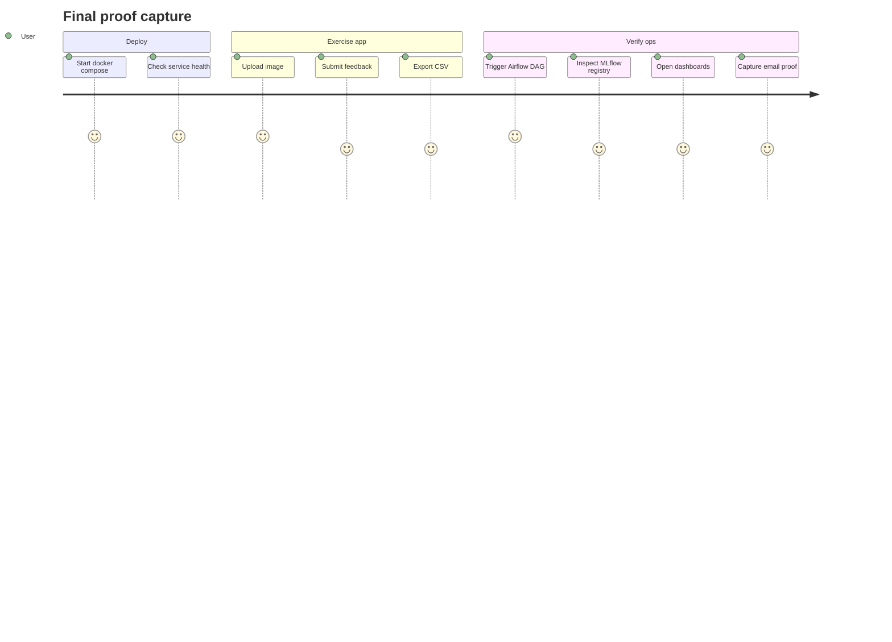

# Test Plan and Test Cases

## Test Strategy

## Automated Tests

| Test file | Coverage |
|---|---|
| `tests/unit/test_schemas.py` | Pydantic request and response models |
| `tests/unit/test_preprocess.py` | Split-count behavior and validation result structure |
| `tests/unit/test_metrics.py` | Drift baseline behavior |
| `tests/unit/test_live_feedback_metrics.py` | Live feedback metric calculation |
| `tests/unit/test_config_contracts.py` | Config contract expectations |
| `tests/unit/test_airflow_retraining_flow.py` | Airflow provenance, DVC push policy, model validation gates, failure-email callback wiring |
| `tests/integration/test_health_contracts.py` | API `/health` contract |

## Functional Test Cases

| ID | Case | Expected result |
|---|---|---|
| F-01 | Run `dvc dag` | DVC graph renders without errors |
| F-02 | Run `dvc repro evaluate report` | Raw, processed, model, metrics, evaluation, and reports are generated |
| F-03 | Open Streamlit frontend | UI loads at `http://localhost:8501` |
| F-04 | Upload one image | Prediction stored in Postgres and shown in UI |
| F-05 | Upload ZIP batch | Batch row and prediction rows are stored |
| F-06 | Export recent predictions CSV | CSV includes required correction columns |
| F-07 | Upload valid correction CSV | Feedback upload and correction rows are stored |
| F-08 | Upload invalid correction CSV | API returns row-level validation errors |
| F-09 | Trigger model reload | Model service reports ready after reload |
| F-10 | Generate report | Latest Markdown and HTML reports exist |

## Airflow Test Cases

| ID | Case | Expected result |
|---|---|---|
| A-01 | Raw dataset missing | DAG branches to `run_dvc_pipeline` |
| A-02 | Model missing | DAG branches to `run_dvc_pipeline` |
| A-03 | New feedback reaches threshold | DAG materializes feedback and runs DVC |
| A-04 | Metrics below threshold | DAG runs DVC |
| A-05 | Healthy state | DAG branches to `skip_retraining`, refreshes the DVC report, and still emails the annotated report |
| A-06 | Registry step completes | Candidate model is registered and registry status stored |
| A-07 | Candidate fails validation | DAG stores rejected validation status and emails the annotated DVC report without reloading model service |
| A-08 | Candidate passes validation but does not beat champion | DAG keeps current champion and emails the final registry decision |
| A-09 | Deployment metadata supplied | MLflow run has `deployment.*` tags and provenance JSON contains deployment fields |
| A-10 | Task fails while failure email is enabled | DAG failure callback sends email through `smtp_default` rather than Airflow's native localhost SMTP path |

## Observability Test Cases

| ID | Case | Expected result |
|---|---|---|
| O-01 | Visit API `/metrics` | API metrics are exposed |
| O-02 | Visit model service `/metrics` | Model metrics are exposed |
| O-03 | Visit pipeline exporter `/metrics` | Pipeline metrics are exposed |
| O-04 | Open Prometheus targets | API, model service, and exporter targets are up |
| O-05 | Open Grafana | Dashboard datasource provisioning works |
| O-06 | Open Loki ready endpoint | Loki is ready and Promtail can push logs |
| O-07 | Fire alert condition | Alertmanager sends email through configured SMTP |
| O-08 | Trigger Airflow task failure | Airflow sends failure notification through configured `smtp_default` connection |

## Manual Proof Checklist

Save proof screenshots in `image/proof/`.
