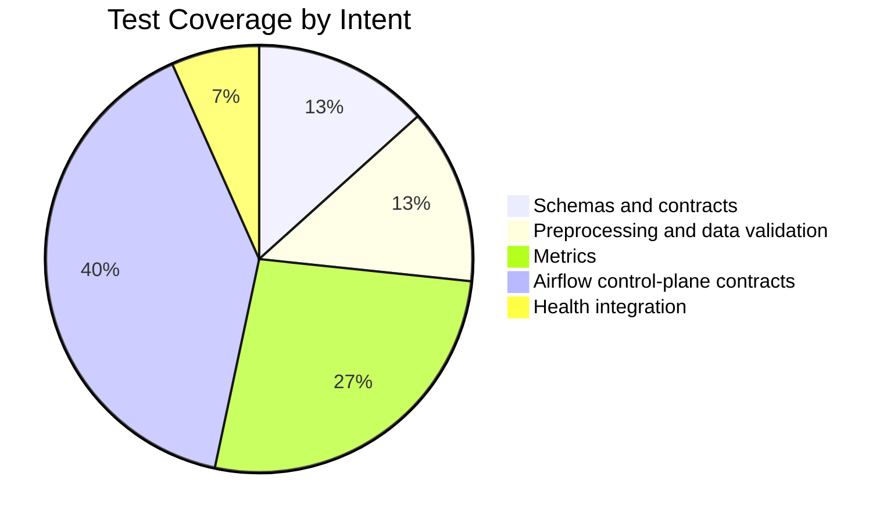
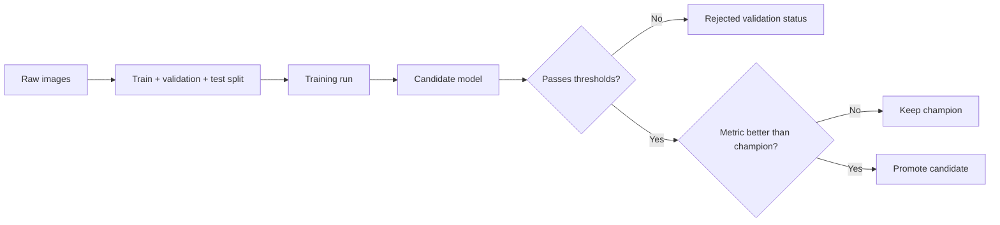

# Test Report

This file records the latest verification state. Update the checkboxes after a final dry run.

## Current Automated Coverage



## Verification Status

| Area | Status | Notes |
|---|---:|---|
| Unit tests | Pending final run | Run `pytest tests/unit` |
| Integration tests | Pending final run | Run `pytest tests/integration` |
| Full test suite | Pending final run | Run `pytest` |
| DVC DAG | Pending final run | Run `dvc dag` |
| Full DVC pipeline | Pending final run | Run `docker compose exec trainer dvc repro report` |
| Airflow control-plane DAG | Pending proof screenshot | Trigger `galaxy_morphology_control_plane` |
| Frontend prediction | Pending proof screenshot | Capture single-image prediction |
| Batch prediction | Pending proof screenshot | Capture ZIP batch result |
| Feedback loop | Pending final run | Submit feedback or upload correction CSV, then inspect Postgres/runtime report |
| MLflow registry | Pending final run | Inspect candidate, validation status, champion alias, and MLflow provenance artifacts |
| Prometheus and Grafana | Pending proof screenshot | Capture targets and dashboard |
| Loki logs | Pending proof screenshot | Capture Loki/Grafana log view |
| Email delivery | Pending proof screenshot | Capture report, Airflow failure, or alert email |

## Final Report Snapshot Template



| Field | Final value |
|---|---|
| Report generated at | `<fill after final run>` |
| Raw images | `<fill after final run>` |
| Images per class | `<fill after final run>` |
| Validation accuracy | `<fill after final run>` |
| Validation macro F1 | `<fill after final run>` |
| Offline accuracy | `<omit if unavailable>` |
| Offline macro F1 | `<omit if unavailable>` |
| Candidate version | `<fill after final run>` |
| Champion version | `<fill after final run>` |
| Registry decision | `<fill after final run>` |
| Feedback rows | `<fill after final run>` |
| Live accuracy | `<fill after final run>` |
| Live macro F1 | `<fill after final run>` |
| Training duration seconds | `<fill after final run>` |

## Commands to Record Final Results

```bash
pytest
dvc dag
docker compose exec trainer dvc repro report
docker compose ps
```

## Final Dry-Run Checklist

- [ ] `.env` configured
- [ ] `docker compose up -d --build` completed
- [ ] `pytest` completed
- [ ] DVC DAG verified
- [ ] Full DVC pipeline verified
- [ ] Airflow DAG triggered
- [ ] Frontend single prediction tested
- [ ] ZIP batch prediction tested
- [ ] Feedback CSV upload tested
- [ ] MLflow registry checked
- [ ] Prometheus targets checked
- [ ] Grafana dashboard checked
- [ ] Loki logs checked
- [ ] Report email checked
- [ ] Airflow failure email checked
- [ ] Screenshots saved under `image/proof/`
