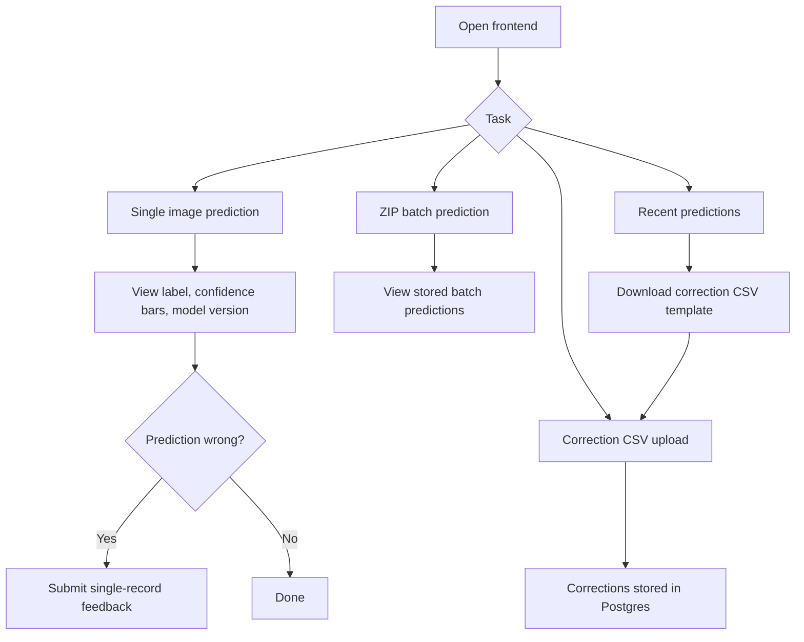
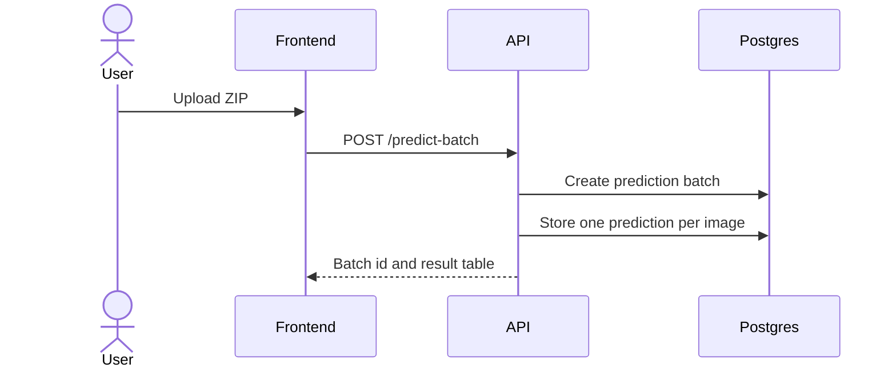

# User Manual

This guide is for a non-technical evaluator using the deployed application.

## User Flow



## Open the App

Open:

```text
http://localhost:8501
```

The main page has four tabs:

| Tab | Purpose |
|---|---|
| Single image | Upload one galaxy image and get a prediction |
| ZIP batch upload | Upload multiple images in one ZIP file |
| Correction CSV upload | Upload validated feedback corrections |
| Recent predictions | View and export prediction history |

## Single Image Prediction

1. Open the `Single image` tab.
2. Upload a supported image file: `.jpg`, `.jpeg`, `.png`, `.bmp`, or `.webp`.
3. Click `Predict Morphology`.
4. Review the predicted class, model version, latency, and confidence chart.

## Submit Single Feedback

Use this when the prediction is wrong.

1. After a prediction, scroll to `Single-record feedback`.
2. Enter the actual label.
3. Optional: add notes.
4. Click `Submit Feedback`.

Valid labels are:

- `elliptical`
- `spiral`
- `lenticular`
- `irregular`
- `merger`

## ZIP Batch Prediction



1. Open the `ZIP batch upload` tab.
2. Upload a ZIP containing supported image files.
3. Click `Run batch prediction`.
4. Review the result table.

## Correction CSV Workflow

1. Open the `Recent predictions` tab.
2. Choose a date range and row limit.
3. Download the filtered prediction CSV template.
4. Fill the `corrected_label` column only for rows that need correction.
5. Open the `Correction CSV upload` tab.
6. Upload the CSV.
7. Fix any validation errors shown in the app and upload again.

The system validates that prediction IDs exist, stored fields match, labels are supported, and corrected labels differ from predicted labels.

## Pipeline Console

Open the `Pipeline Console` page from the Streamlit sidebar. It shows health checks and links for:

- Airflow
- MLflow
- Prometheus
- Grafana
- Loki
- FastAPI docs
- Pipeline exporter

## Generated Report

The main page shows the latest generated Markdown report from:

```text
artifacts/reports/latest_report.md
```

The final submitted PDF report is also present at:

```text
report.pdf
```

## Reproducing a Training Run

To recreate artifacts from a recorded run, check out the matching code version, download that MLflow run's `dvc.lock` artifact, replace the local root `dvc.lock`, and run:

```bash
dvc pull
```

For Airflow-created runs, MLflow also stores a `provenance.json` artifact next to `dvc.lock`. Use it to confirm the Airflow run id, MLflow run id, DVC lock hash, feedback snapshot, and any deployment metadata supplied by CI/CD.
