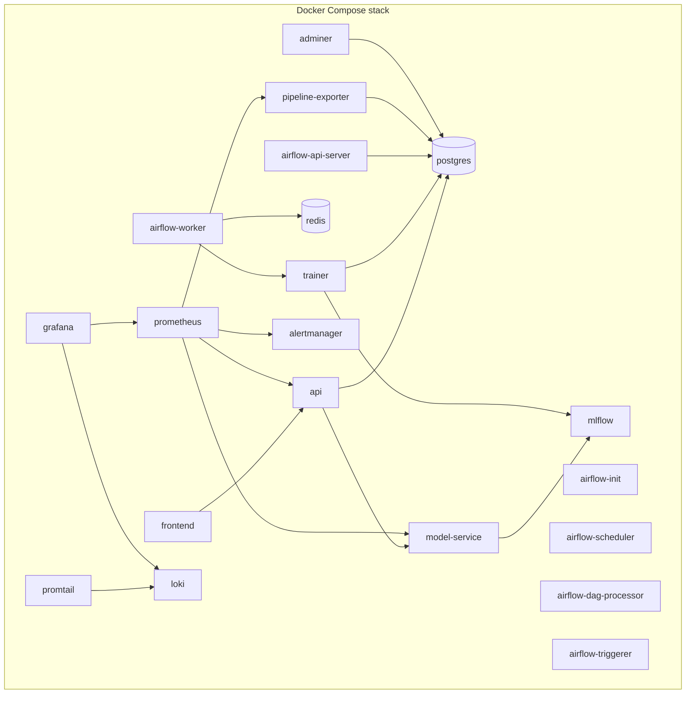
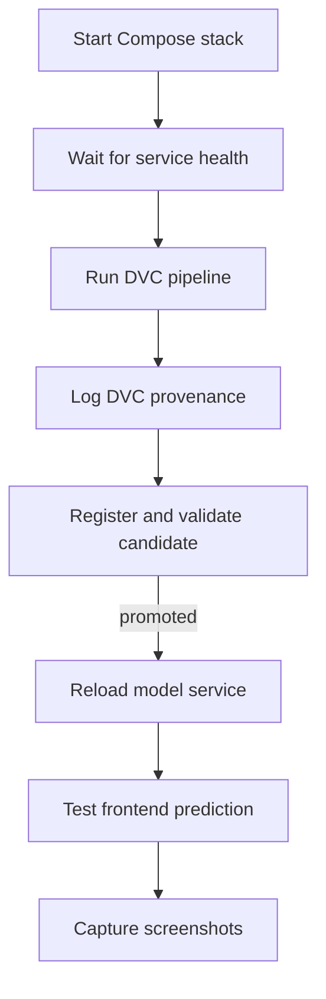

# Deployment Runbook

## Deployment Topology



## Prerequisites

- Docker Desktop or Docker Engine with Compose
- `.env` configured from `.env.example`
- Enough disk space for Galaxy Zoo cache, image subsets, model artifacts, and volumes
- SMTP or Mailtrap credentials if email proof is required

## Start the Stack

```bash
docker compose up -d --build
```

Check status:

```bash
docker compose ps
```

## Service URLs

| Service | URL |
|---|---|
| Frontend | http://localhost:8501 |
| API docs | http://localhost:8000/docs |
| Model service docs | http://localhost:8001/docs |
| Airflow | http://localhost:8080 |
| MLflow | http://localhost:5000 |
| Prometheus | http://localhost:9090 |
| Alertmanager | http://localhost:9093 |
| Grafana | http://localhost:3000 |
| Adminer | http://localhost:8081 |

## First Run



Run the pipeline:

```bash
docker compose exec trainer dvc repro report
```

Register the latest candidate model and run the promotion decision:

```bash
docker compose exec trainer python -m src.registry.register_best_model register-candidate
docker compose exec trainer python -m src.registry.register_best_model promote-candidate
```

Reload serving only if the promotion decision updates the champion alias:

```bash
curl -X POST http://localhost:8001/reload
```

## Airflow Operation

Open Airflow at `http://localhost:8080` and trigger:

```text
galaxy_morphology_control_plane
```

The DAG inspects state, optionally syncs feedback, runs `dvc repro report`, pushes DVC artifacts when `dvc.push_on_success` is `true`, saves `dvc.lock` provenance, logs `dvc.lock` and `provenance.json` to MLflow, registers a candidate, validates candidate accuracy and macro F1, promotes only passing candidates, reloads the model service only after promotion, generates a runtime report, and emails that runtime report. If CI/CD supplies `DEPLOYMENT_GIT_COMMIT_SHA`, `APP_VERSION`, `CONTAINER_IMAGE`, or `CI_RUN_ID`, those values are recorded in the provenance JSON and mirrored as MLflow `deployment.*` tags.
When DVC runs, the DAG fails if the configured DVC push fails or if MLflow provenance artifact logging fails. DVC pipeline reports are kept under `artifacts/reports/`; Airflow runtime email reports are generated separately under `artifacts/runtime/`.
The DAG schedule is controlled by `continuous_improvement.monitor_schedule` and defaults to `30 12 * * *`; Airflow catchup is disabled. The runtime email uses the training-and-monitoring report sections and omits unavailable metric rows.

## Reproducing a Run

1. Check out the code version that produced the MLflow run.
2. Download that run's `dvc.lock` artifact from MLflow.
3. Replace the local root `dvc.lock` with the downloaded file.
4. Pull the recorded DVC artifacts:

```bash
dvc pull
```

## Report Regeneration

```bash
docker compose exec trainer python -m src.reporting.generate_report
```

Generated outputs:

```text
artifacts/reports/latest_report.md
artifacts/reports/latest_report.html
```

Generate the Airflow runtime email report:

```bash
docker compose exec trainer python -m src.reporting.generate_runtime_report
```

Generated outputs:

```text
artifacts/runtime/latest_runtime_report.md
artifacts/runtime/latest_runtime_report.html
```

## Database Evidence Queries

Use Adminer or `psql`.

```sql
SELECT artifact_key, stage_name, recorded_at
FROM latest_pipeline_artifact_snapshots
ORDER BY artifact_key;
```

```sql
SELECT prediction_id, predicted_label, model_version, created_at
FROM predictions
ORDER BY created_at DESC
LIMIT 20;
```

```sql
SELECT prediction_id, predicted_label, corrected_label, created_at
FROM feedback_corrections
ORDER BY created_at DESC
LIMIT 20;
```

```sql
SELECT service, level, message, created_at
FROM service_logs
ORDER BY created_at DESC
LIMIT 50;
```

## Troubleshooting

| Symptom | Check | Fix |
|---|---|---|
| API not ready | `http://localhost:8000/ready` | Ensure model service and Postgres are healthy |
| Model service not ready | `http://localhost:8001/ready` | Run training/register model or verify `models/latest` |
| Airflow DAG fails on DVC | Airflow task logs | Check trainer dependencies and mounted repo path |
| MLflow registry unavailable | MLflow URL and Postgres health | Restart `mlflow` after Postgres is healthy |
| No Prometheus targets | Prometheus `/targets` | Verify service names and ports in `prometheus.yml` |
| No emails | Alertmanager/Airflow SMTP config | Verify `.env` and Airflow SMTP connection |

## Shutdown

Stop containers but keep volumes:

```bash
docker compose down
```

Stop and remove volumes only when a clean rebuild is intended:

```bash
docker compose down -v
```

Use volume removal carefully because it deletes Postgres, MLflow, Loki, and Alertmanager persisted state.
